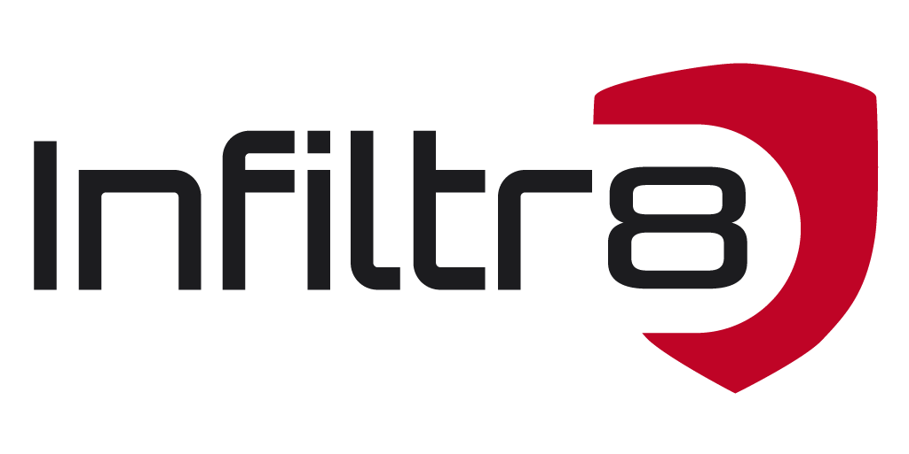

<div align="center">

<picture>
  <source media="(prefers-color-scheme: dark)" srcset="site/public/assets/logo-infiltr8-dark.png">
  <source media="(prefers-color-scheme: light)" srcset="site/public/assets/logo-infiltr8-light.png">
  
</picture>

### The Red-Book

**The Art of Offensive CyberSecurity**

Technical notes and cheat sheets for red teamers, pentesters and security
researchers — sourced from research papers, industry blogs and field
experience, and kept in one place.

<p>
  
  
  
  
</p>

</div>

---

## What's inside

| Section | Pages | Covers |
| :--- | ---: | :--- |
| **Red-Teaming** | 248 | The host & endpoint lifecycle, ordered by the ATT&CK kill chain — recon, execution, persistence, privilege escalation, defense evasion, credential access, lateral movement, exfiltration |
| **Active Directory** | 136 | Kerberos, NTLM, AD-CS, DACLs, delegations, coerced authentication, SCCM/MECM, trusts, persistence |
| **Web Pentesting** | 61 | Server-side and client-side vulnerabilities, plus web servers, CMSs, frameworks and DBMSs |
| **Cloud & CI/CD** | 61 | AWS and Entra ID identity abuse, Kubernetes, containers, and the pipelines that deploy them |
| **Network & Wireless** | 28 | Service-by-service notes for the protocols you meet on an engagement, plus WiFi and Bluetooth |
| **Smart Contracts** | 18 | EVM attack surfaces, upgradeability patterns and protocol-layer weaknesses, tagged with SCWE IDs |
| **AI Red-Teaming** | 5 | 🛠️ LLMs, RAG, ML, agents and training infrastructure — in progress |

Techniques are tagged with **MITRE ATT&CK** identifiers where they map, and
**OWASP WSTG** / **SCWE** identifiers in the web and smart-contract sections.

## Running it locally

The site is a static [Fumadocs](https://fumadocs.dev) / Next.js build living in
[`site/`](site/).

```bash
cd site
npm install
npm run build     # -> site/out/
npm start         # serve it
```

Content is `site/content/docs/**.mdx` — edit it directly. See
[`site/README.md`](site/README.md) for navigation conventions, the resource-link
metadata cache, and the handful of non-obvious build constraints.

## Contributing

Corrections and additions are welcome — open an issue or a pull request. The
techniques here have been vetted and tested, but we're human and mistakes are
possible.

When adding external resource links, run `npm run links` in `site/` so the card
picks up the target's title and favicon. CI does this automatically on push.

## Credits

Around 90% of the **Active Directory** content originates from
[The Hacker Recipes](https://www.thehacker.recipes/). Many thanks to
[Charlie Bromberg](https://twitter.com/_nwodtuhs) for that work.

Previously published with GitBook; the original markdown source remains in this
repository's history prior to the migration.

## Disclaimer

Provided for **educational and informational purposes only**.

Offensive security **is not about malicious intent** — it is about understanding
the tactics an adversary would use, and applying that understanding to defend
against them.

- **No unlawful activity.** Using anything here for unauthorised access, or any
  activity that violates applicable law, is strictly prohibited.
- **Ethical use.** Apply these techniques only where you have explicit
  authorisation to do so.
- **Your responsibility.** You alone are accountable for your actions and their
  consequences. infiltr8 and its contributors accept no liability for misuse.
- **No guarantees.** We aim for accuracy but make no warranty as to
  completeness or reliability — verify independently.
- **No endorsement.** Mentioning a tool or service is not an endorsement, and we
  are not responsible for third-party content or security.

<div align="center">
<sub>Knowledge is power, and with power comes responsibility.</sub>
</div>
