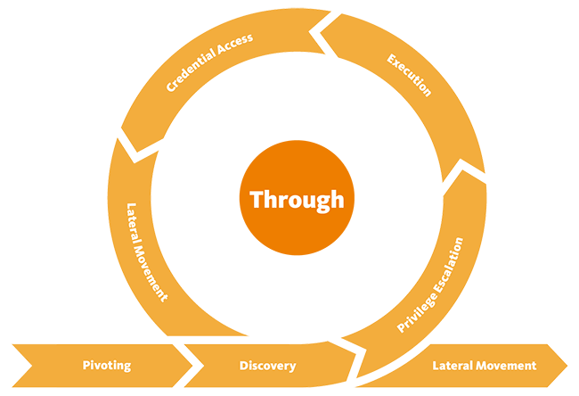

# Credential Access

## Theory

Credential Access consists of techniques for stealing credentials like account names and passwords. Techniques used to get credentials include keylogging,credential dumping, passwod attacks, etc. Using legitimate credentials can give us access to systems, make us harder to detect, and provide the opportunity to create more accounts to help achieve our goals.

<figure><figcaption></figcaption></figure>

## Resources


