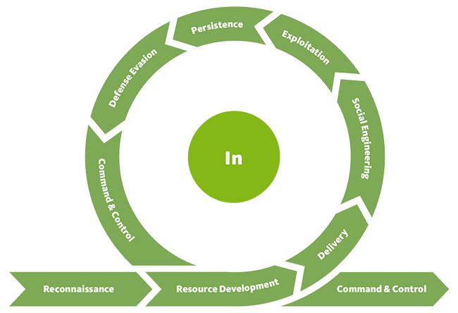

# Initial Access

## Theory

Initial Access consists of techniques that use various entry vectors to gain initial foothold within a network or target. This is how will the weaponized function be delivered to the target. Techniques used to gain a foothold include targeted spearphishing and exploiting weaknesses on public-facing web servers, and even password spraying/guessing.

The "Initial Access" Technique of MITRE ATT\&CK Framework may refer to the "Delivery" step of the Unified Kill Chain.

## Resources




