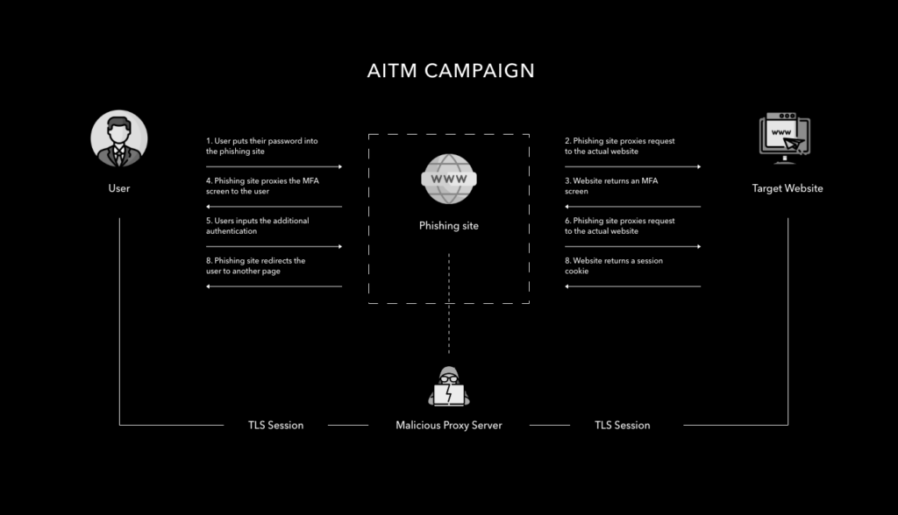

# Adversary in the Middle (AitM) Phishing

## Theory

AitM phishing is a technique that uses dedicated tooling to act as a proxy between the target and a legitimate login portal for an application, principally to make it easier to **defeat MFA protection**.

Adversaries may attempt to proxy multi-domain destination traffic (both TLS and non-TLS) over a single domain, without a requirement of installing any additional certificate on the client.

<figure><figcaption></figcaption></figure>

## Practice

## Resources




