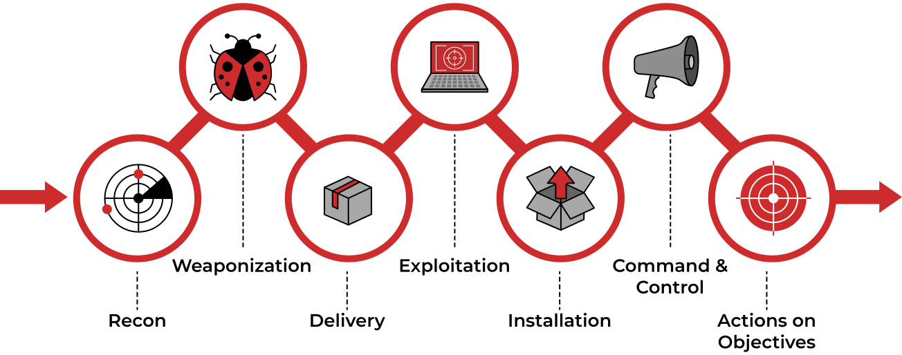

# Defense Evasion 

## Theory

Defense Evasion consists of techniques that adversaries use to avoid detection throughout their compromise. Techniques used for defense evasion include uninstalling/disabling security software or obfuscating/encrypting data and scripts. Adversaries also leverage and abuse trusted processes to hide and masquerade their malware. Other tactics’ techniques are cross-listed here when those techniques include the added benefit of subverting defenses. 

Defense Evasion techniques can be use by an attackers on various steps of the Cyber Kill Chain model.

## Resources

