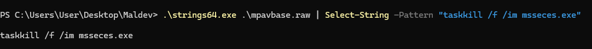

# 🛠️ AppLocker Bypass

## Theory

[AppLocker](https://learn.microsoft.com/en-us/windows/security/application-security/application-control/app-control-for-business/applocker/what-is-applocker) is a security feature introduced in Windows 7 Enterprise and later versions, providing a robust application whitelisting solution to control executable, script, and installer file execution. It aims to replace older [Software Restriction Policies (SRP)](https://learn.microsoft.com/en-us/windows-server/identity/software-restriction-policies/software-restriction-policies) by adding enhanced control and a kernel-level enforcement mechanism.&#x20;


Although AppLocker is gradually being replaced by [Windows Defender Application Control (WDAC)](https://learn.microsoft.com/en-us/hololens/windows-defender-application-control-wdac), Formerly known as Device Guard, it remains a popular solution for enterprises due to ease of configuration and deployment.

_WDAC relies on_ [_virtualization-based security (VBS)_](https://learn.microsoft.com/en-us/windows-hardware/design/device-experiences/oem-vbs) _and_ [_HyperVisor Code Integrity (HVCI)_ ](https://learn.microsoft.com/en-us/windows-hardware/drivers/bringup/device-guard-and-credential-guard)_which are only available in Windows 10, Windows 11, and Windows Server 2016 and later_


AppLocker consists of two core components:

* **The kernel-mode driver (`APPID.SYS`):**
  * This kernel-level driver provides the foundational enforcement for AppLocker policies by handling process creation blocking through a Process Notification Callback ([PsSetCreateProcessNotifyRoutineEx](https://learn.microsoft.com/en-us/windows-hardware/drivers/ddi/ntddk/nf-ntddk-pssetcreateprocessnotifyroutineex)). This callback intercepts attempts to execute files and forwards information to AppLocker policies.
  * Additionally, `APPID.SYS` assists in applying broader application control functions, distinguishing it from SRP, which operates entirely in user mode.
* **The user-mode service (`AppIDSvc`):**
  * The `AppIDSvc` service primarily functions as a policy manager, responsible for administrating the whitelist ruleset and performing tasks that are impractical to handle at the kernel level, such as comprehensive code signature verification.
  * The `AppIDSvc` interacts with the `APPID.SYS` driver via Remote Procedure Calls (RPC) to verify digital signatures and validate applications against AppLocker policies.

<figure><figcaption><p><a href="https://www.tiraniddo.dev/2019/11/the-internals-of-applocker-part-1.html">https://www.tiraniddo.dev/2019/11/the-internals-of-applocker-part-1.html</a></p></figcaption></figure>

## Practice

This section delves into practical bypass methods, exploring weaknesses in AppLocker’s implementation and configuration. It covers techniques ranging from exploiting policy misconfigurations, abusing trusted applications (living-off-the-land binaries, or LOLBins), manipulating file path rules, and leveraging signature-based bypasses.

### Enumeration

Enumeration is the crucial initial step, providing insight into the specific rules, policies, and whitelisting configurations that AppLocker enforces. By gathering this information, it becomes possible to determine which executables, paths, scripts, and DLLs are allowed or restricted, enabling a strategic approach to potential bypass techniques.



The following commands can be used to check whether any AppLocker rules are being enforced.

```powershell
Get-AppLockerPolicy -Effective -Xml
(Get-AppLockerPolicy -Local).RuleCollections
Get-ChildItem -Path HKLM:\SOFTWARE\Policies\Microsoft\Windows\SrpV2 -Recurse
Get-AppLockerPolicy -Effective | select -ExpandProperty RuleCollections
```



## Resources










