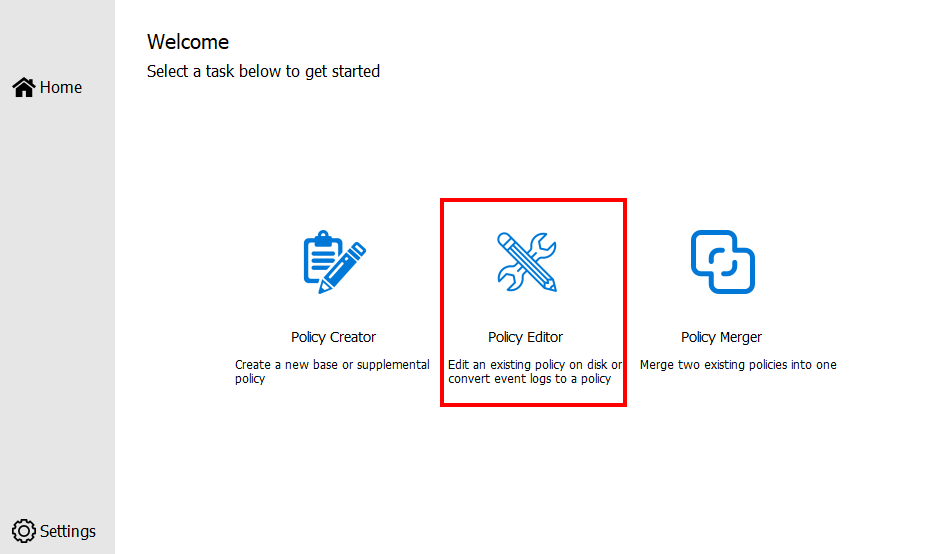
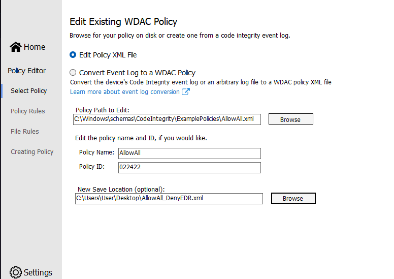
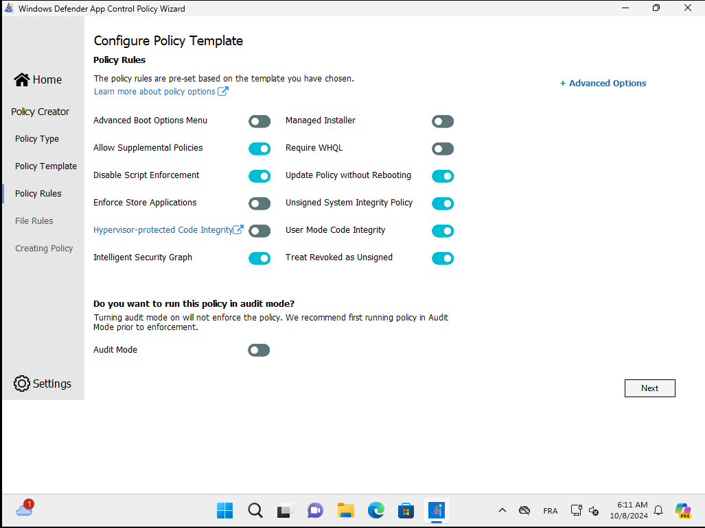
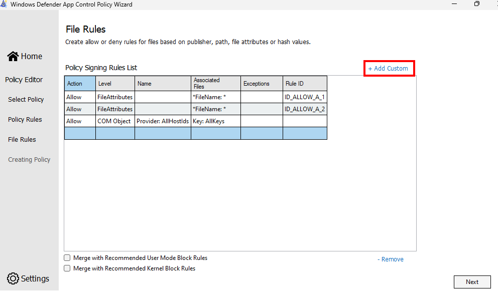
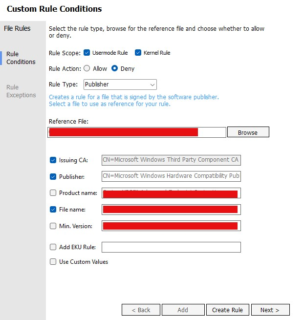
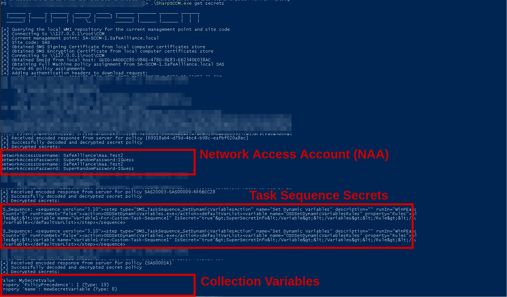
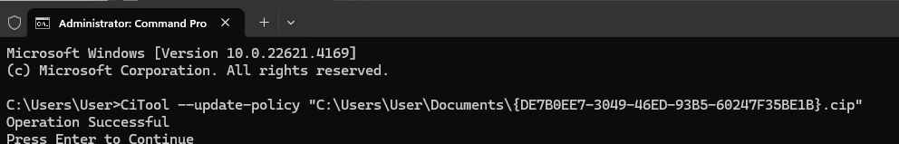

# Windows Defender Application Control (WDAC)

Theory

Windows Defender Application Control (WDAC) was introduced with Windows 10 and allows organizations to control which drivers and applications are allowed to run on their Windows clients. It was designed as a security feature under the [servicing criteria](https://www.microsoft.com/msrc/windows-security-servicing-criteria), defined by the Microsoft Security Response Center (MSRC).

**EDR drivers or binaries can therefore be blocked using a WDAC policy.**


In order to bypass EDR products using the following method, a reboot is required, which is a bad OPSEC operation.


## Practice

In order to set up a Windows Defender Application Control (WDAC) policy that can tamper with a targeted EDR, follow this guide:



### 1. Setup Your Environement

On a fresh installed Windows Virtual machine, we will install:

* [Dotnet 8 SDK](https://dotnet.microsoft.com/en-us/download/dotnet/thank-you/sdk-8.0.403-windows-x64-installer)
* [WDAC Wizzard](https://webapp-wdac-wizard.azurewebsites.net/)
* The targetted EDR Agen

### 2. Create a WDAC Policy

When all setup, we can start creating an EDR-Blocking WDAC Policy using the WDAC Wizzard utility:

1. Select "Policy Editor"

<figure><figcaption></figcaption></figure>

2. Select the "AllowAll" template from `C:\Windows\Schemas\CodeIntgrity\ExamplePolicies\AllowAll.xml` and click "Next"

<figure><figcaption></figcaption></figure>

3. Ensure that "Audit Mode" is Unchecked, click "Next"

<figure><figcaption></figcaption></figure>

4. Click "Add Custom"

<figure><figcaption></figcaption></figure>

5. Specify conditions on the targeted EDR Publisher, executable/drivers hashes, Product Name, or even Paths.


For this technique to be effective in tampering with EDR functions, it is essential to identify and select both user-land processes (e.g., PE/exe files) and drivers (e.g., sys files) that are necessary for the EDR's to properly work.



However, avoid blocking entire EDR related drivers and processes, as this may lead to system crashes or blue screens. \
Instead, **focus on blocking the minimal components, necessary to interfere with the essential functions of the EDR.**


<figure><figcaption></figcaption></figure>

6. When done, wait for the WDAC Policy to build. It will create an XML and PolicyBinary file.

<figure><figcaption></figcaption></figure>

### 3. Apply the WDAC Policy

Using the previous builded PolicyBinary file, we can [apply the WDAC Policy](https://learn.microsoft.com/en-us/windows/security/application-security/application-control/app-control-for-business/deployment/appcontrol-deployment-guide).

```powershell
# Windows 11 22H2 and above
CiTool --update-policy C:\Path\To\{Policy}.cip

# Windows 11, Windows 10 version 1903 and above, 
# And Windows Server 2022 and above
$PolicyBinary = "C:\Path\To\{Policy}.cip"
$DestinationFolder = $env:windir+"\System32\CodeIntegrity\CIPolicies\Active\"
$RefreshPolicyTool = "<Path where RefreshPolicy.exe can be found from managed endpoints>"
Copy-Item -Path $PolicyBinary -Destination $DestinationFolder -Force
& $RefreshPolicyTool

# All other versions of Windows and Windows Server
$PolicyBinary = "C:\Path\To\{Policy}.cip"
$DestinationBinary = $env:windir+"\System32\CodeIntegrity\SiPolicy.p7b"
Copy-Item  -Path $PolicyBinary -Destination $DestinationBinary -Force
Invoke-CimMethod -Namespace root\Microsoft\Windows\CI -ClassName PS_UpdateAndCompareCIPolicy -MethodName Update -Arguments @{FilePath = $DestinationBinary}
```

<figure><figcaption></figcaption></figure>

Once the successful execution, **restart the host.**

### 4. Enjoy

After reboot, (and maybe several tests) the EDR should be disabled.



## Resources




