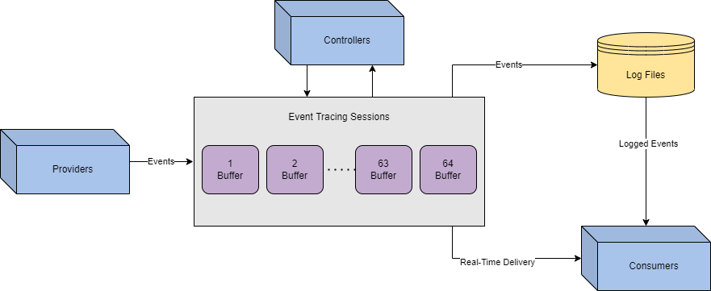

# ETW evasion

## Theory

[Event Tracing for Windows (ETW)](https://learn.microsoft.com/en-us/windows-hardware/drivers/devtest/event-tracing-for-windows--etw-) provides a mechanism to trace and log events that are raised by user-mode applications and kernel-mode drivers.

### ETW Direct Attacks - Opsec considerations


Directly deleting ETW logs can be an OPSEC (Operational Security) risk.


Assuming an attacker did destroy all of the logs before they were forwarded to a SIEM by the SOC, or if they were not forwarded, how would this raise an alert? An attacker must first consider environment integrity; if no logs originate from a device, that can present serious suspicion and lead to an investigation. Even if an attacker did control what logs were removed and forwarded, defenders could still track the tampering.

| EventID  | Description                                           |
| -------- | ----------------------------------------------------- |
| **1102** | Logs when the Windows Security audit log was cleared  |
| **104**  | Logs when the log file was cleared                    |
| **1100** | Logs when the Windows Event Log service was shut down |

## ETW Components

ETW is broken up into three separate components, working together to manage and correlate data. Event logs in Windows are no different from generic XML data, making it easy to process and interpret.

**Event Controllers** are used to build and configure sessions. To expand on this definition, we can think of the controller as the application that determines how and where data will flow. From the [Microsoft docs](https://docs.microsoft.com/en-us/windows/win32/etw/about-event-tracing#controllers), “Controllers are applications that define the size and location of the log file, start and stop event tracing sessions, enable providers so they can log events to the session, manage the size of the buffer pool, and obtain execution statistics for sessions.”

**Event Providers** are used to generate events. To expand on this definition, the controller will tell the provider how to operate, then collect logs from its designated source. From the [Microsoft docs](https://docs.microsoft.com/en-us/windows/win32/etw/about-event-tracing#providers), “Providers are applications that contain event tracing instrumentation. After a provider registers itself, a controller can then enable or disable event tracing in the provider. The provider defines its interpretation of being enabled or disabled. Generally, an enabled provider generates events, while a disabled provider does not.”

**Event Consumers** are used to interpret events. To expand on this definition, the consumer will select sessions and parse events from that session or multiple at the same time. This is most commonly seen in the “_Event Viewer”._ From the [Microsoft docs](https://docs.microsoft.com/en-us/windows/win32/etw/about-event-tracing#consumers), “Consumers are applications that select one or more event tracing sessions as a source of events. A consumer can request events from multiple event tracing sessions simultaneously; the system delivers the events in chronological order. Consumers can receive events stored in log files, or from sessions that deliver events in real time.”

<figure><figcaption></figcaption></figure>

Now that we understand how ETW is instrumented, how does this apply to attackers? We previously mentioned the goal of limiting visibility while maintaining integrity. We can limit a specific aspect of insight by targeting components while maintaining most of the data flow. Below is a brief list of specific techniques that target each ETW component.

| Component  | Techniques                                                                              |
| ---------- | --------------------------------------------------------------------------------------- |
| Provider   | PSEtwLogProvider Modification, Group Policy Takeover, Log Pipeline Abuse, Type Creation |
| Controller | Patching EtwEventWrite, Runtime Tracing Tampering,                                      |
| Consumers  | Log Smashing, Log Tampering                                                             |

## Practice

To find where AMSI is instrumented, we can use [InsecurePowerShell](https://github.com/cobbr/InsecurePowerShell) maintained by [Cobbr](https://github.com/cobbr) which is a GitHub fork of PowerShell with security feature removed, and compare it with an [offical PowerShell GitHub](https://github.com/PowerShell/PowerShell).

### PowerShell Downgrade

The PowerShell downgrade attack is a very low-hanging fruit that allows attackers to modify the current PowerShell version to remove security features.\
Most PowerShell sessions will start with the most recent PowerShell engine, but attackers can manually change the version with a one-liner. By "downgrading" the PowerShell version to 2.0, you bypass security features since they were not implemented until version 5.0.



We can simply use this command to downgrad powershell. This attacked is used in popular tools such as [Unicorn](https://github.com/trustedsec/unicorn)

```bash
PowerShell -Version 2
```


Since this attack is such low-hanging fruit and simple in technique, there are a plethora of ways for the blue team to detect and mitigate this attack.




## References


