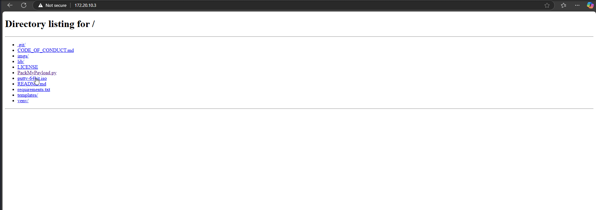

# Mark-of-the-Web (MotW) Bypass

## Theory

Windows uses the [Mark-of-the-Web (MotW)](https://attack.mitre.org/techniques/T1553/005/) to indicate that a file originated from the Internet, which gives [Microsoft Defender SmartScreen](https://learn.microsoft.com/en-us/windows/security/threat-protection/microsoft-defender-smartscreen/microsoft-defender-smartscreen-overview) an opportunity to perform additional inspection of the content. MotW also supplies the basis for prompting a user with an additional prompt when [high-risk extensions](https://www.geoffchappell.com/studies/windows/shell/shlwapi/api/assocapi/geturlaction.htm) are opened.

MotW is applied to a file by appending a [Zone.Identifier](https://learn.microsoft.com/en-us/openspecs/windows_protocols/ms-fscc/6e3f7352-d11c-4d76-8c39-2516a9df36e8) Alternate Data Stream (ADS) to the downloaded file that indicates the URL, and, optionally, the referrer URL from which the file originated. Antivirus (AV) and endpoint detection and response (EDR) products can use this information to supplement their reputation lookups.

<figure><figcaption></figcaption></figure>

However, Alternate Data Stream (ADS) requires an NTFS file system. We may bypass MotW by unsing container file formats that support other file systems outside of NTFS like `.iso`, `.img`, .`vhd`, and .`vhdx`. Windows can automatically mount these file systems, so all that we need it's the victim to double-click the container file and then double-click the embedded malicious file that won’t have MotW applied.

## Practice



[PackMyPayload](https://github.com/mgeeky/PackMyPayload) (Python) can be use to packages payloads into output containers to evade Mark-of-the-Web flag. It supports: ZIP, 7zip, PDF, ISO, IMG, CAB, VHD, VHDX.

```bash
# Example packing Putty into an ISO file
.py putty-64bit-0.83-installer.msi putty-64bit.iso
```

After getting the `putty-64bit.iso`on our Windows target, we see that the .msi inside the ISO, is not MOTW-marked.


We can however notice that the ISO file itself will be MOTW-Marked.


<figure><figcaption><p>PackMyPayload Testings</p></figcaption></figure>



## Resources




