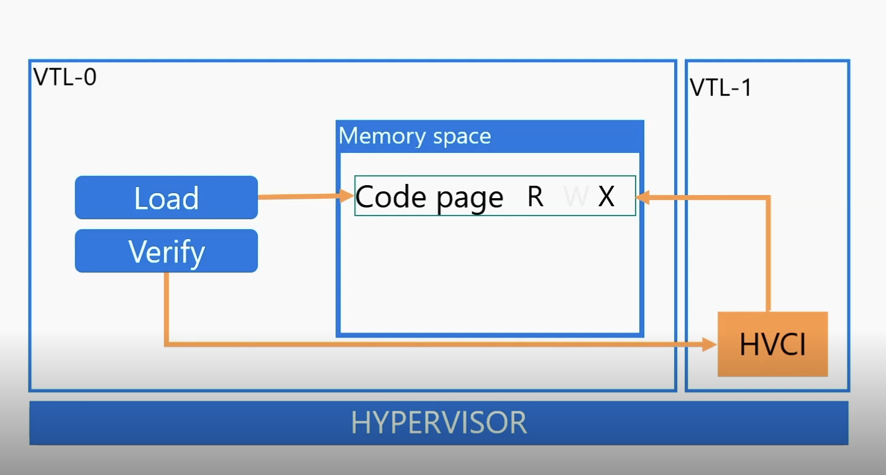

# 🛠️ hypervisor-protected code integrity (HVCI) Bypass

## Theory

HVCI, at a high level, is a technology on Windows systems that prevents attackers from executing unsigned-code in the Windows kernel by essentially preventing readable, writable, and executable memory (RWX) in kernel mode. If an attacker cannot write to an executable code page - they cannot place their shellcode in such pages. On top of that, if attackers cannot force data pages (which are writable) to become code pages - said pages which hold the malicious shellcode can never be executed.

HVCI leverages virtualization technologies provided by the CPU and the Hyper-V hypervisor to enforce its security mechanisms. Hyper-V, Microsoft’s hypervisor, creates isolated environments by using partitions — the root partition for the host operating system and child partitions for virtual machines (VMs). This isolation prevents one VM from accessing the memory or resources of another VM or the host system.

To achieve its goals, HVCI utilizes Second Layer Address Translation (SLAT), known as Extended Page Tables (EPT) in Intel CPUs. SLAT provides an additional layer of memory translation that allows the hypervisor to control how physical memory is allocated and accessed by VMs. When a VM attempts to access memory, the hypervisor uses SLAT to intercept and translate the memory request from the VM's perspective to the actual physical memory on the host machine.

**Address Translation and Security Enforcement**

1. **Guest Physical Address (GPA) to System Physical Address (SPA):** SLAT translates the VM's guest physical addresses (GPAs) to the actual system physical addresses (SPAs) on the host using Extended Page Tables (EPT). This translation process ensures that the VM can only access the memory allocated to it and not any other memory on the host system.
2. **Extended Page Table Entries (EPTEs):** EPTEs are used to manage this translation and enforce security policies by defining the allowed access types (read, write, execute) for physical memory. For example, if a page is marked as writable/executable in the virtual memory but the corresponding physical memory is read-only, any attempt to write or execute from that page will result in an access violation. This behavior prevents unauthorized modifications or execution of code, reinforcing security.
3. **Memory Protection:** HVCI relies on the principle that physical memory protections override virtual memory permissions. Even if virtual memory is configured to be writable or executable, the physical memory settings enforced by the hypervisor will take precedence, ensuring that malicious code cannot run in the kernel.

<figure><figcaption>
Load in RW --> Set RX after verifying
</figcaption></figure>

## Practice

TODO

## Resources


