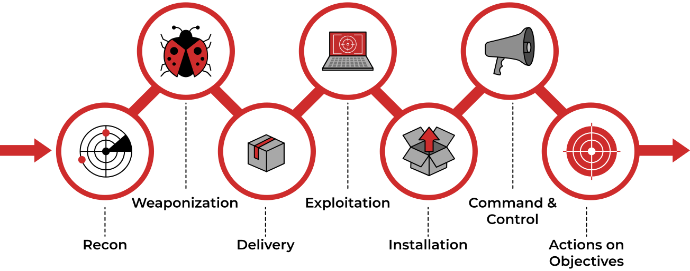

# Exfiltration

## Theory

Exfiltration refers to techniques and attributes that result or aid in removing files and information from the targeted mobile device. We may steal data by exfiltrating it over a different protocol than that of the existing command and control channel. The data may also be sent to an alternate network location from the main command and control server.

Alternate protocols include FTP, SMTP, HTTP/S, DNS, SMB, or any other network protocol not being used as the main command and control channel.

Data Exfiltration often happens at the last stage of the Cyber Kill Chain model, Actions on Objectives.

## Resources




