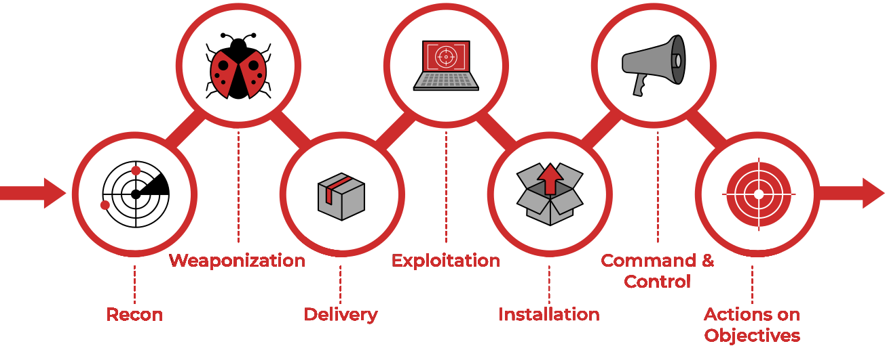

# Persistence

## Theory

Persistence consists of techniques used to keep access to systems across restarts, changed credentials, and other interruptions that could cut off our access. Techniques used for persistence include any access, action, or configuration changes that let us maintain our foothold on systems, such as replacing or hijacking legitimate code or adding startup code.

<figure><figcaption></figcaption></figure>

The "Persistence" Technique of MITRE ATT\&CK Framework refers to the "Installation" step of the Cyber Kill Chain.

## Resources


