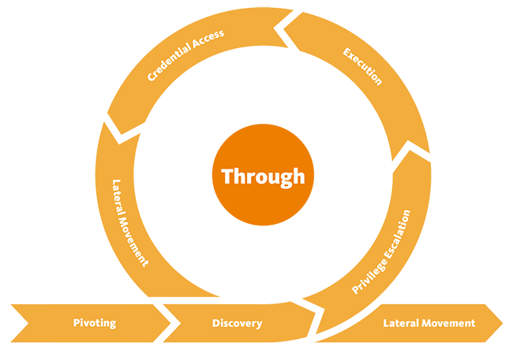

# Lateral Movement

## Theory

Lateral Movement consists of techniques that adversaries use to enter and control remote systems on a network. Following through on their primary objective often requires exploring the network to find their target and subsequently gaining access to it. Reaching their objective often involves pivoting through multiple systems and accounts to gain. Adversaries might install their own remote access tools to accomplish Lateral Movement or use legitimate credentials with native network and operating system tools, which may be stealthier.

## Resources


