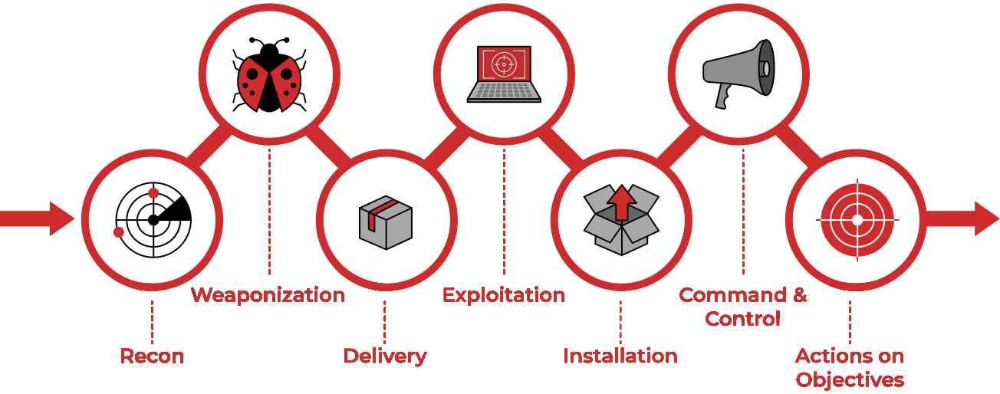

# Reconnaissance

## Theory

Reconnaissance consists of techniques that involve adversaries actively or passively gathering information that can be used to support targeting. Such information may include details of the victim organization, infrastructure, or staff/personnel. This information can be leveraged by the adversary to aid in other phases of the adversary lifecycle, such as using gathered information to plan and execute Initial Access, to scope and prioritize post-compromise objectives, or to drive and lead further Reconnaissance efforts.

## Resources






